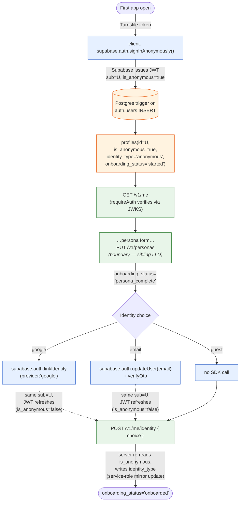
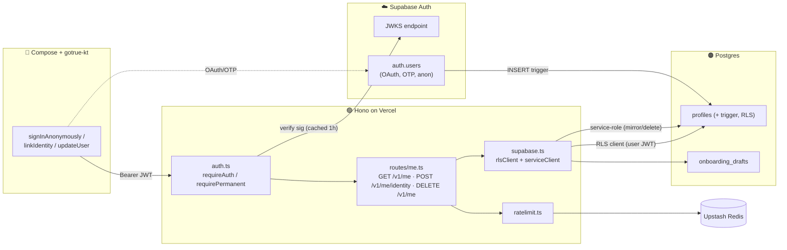
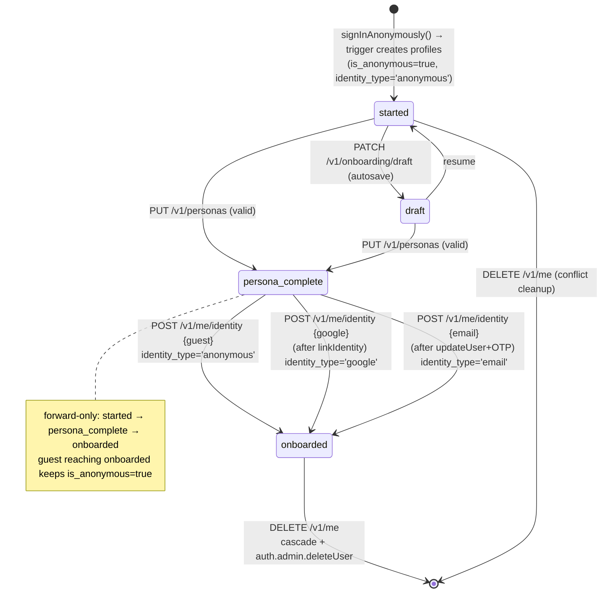
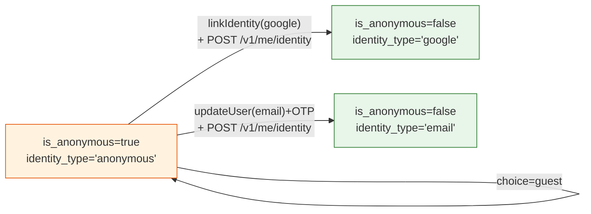
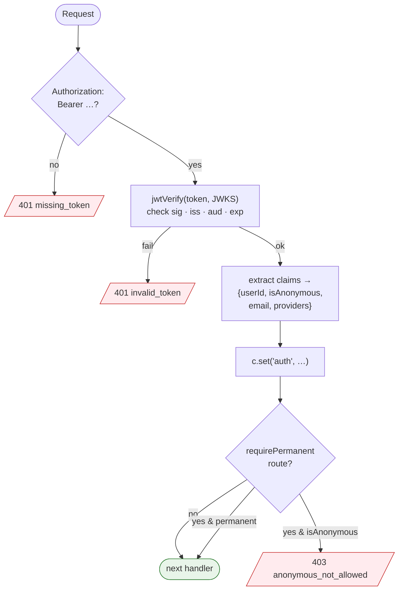
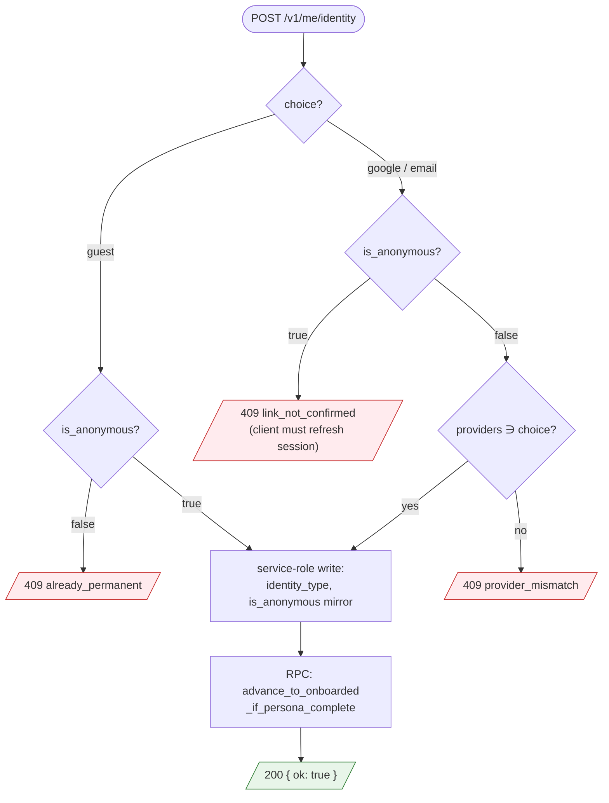
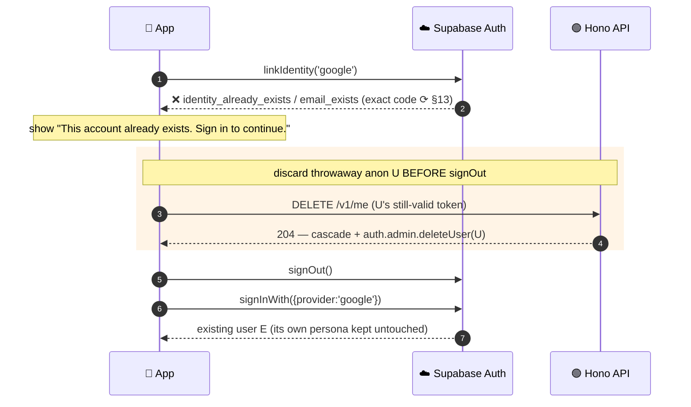
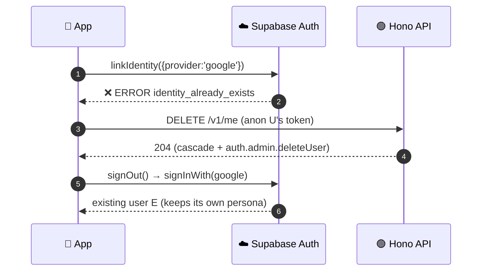

# LLD: SoWhat News — Backend Login

**Date**: 2026-06-12 15:20 IST
**Researcher**: Anjay Sahoo
**Git Commit**: `d972536720dd7da6d09cbb18d3d6bb3b9103342f`
**Branch**: `master`
**Repository**: so-what-news-app
**Scope**: **Backend only**, and specifically the **login / identity layer** — anonymous bootstrap, JWT verification middleware, identity linking reconciliation, the `profiles` identity lifecycle, RLS gating, and abuse controls. The persona *form* (onboarding fields, `bucket_hash`, timezone, topic normalisation) is a sibling LLD; here we only document the **handoff boundary** to `PUT /v1/personas`.

**Builds on**:
- [`2026-06-10-sowhat-news-login-and-onboarding-flow-hld.md`](./2026-06-10-sowhat-news-login-and-onboarding-flow-hld.md) — the HLD this LLD implements (anonymous-first, link-in-place, `is_anonymous` gating, `POST /v1/me/identity`, conflict Option A).
- [`2026-05-26-sowhat-news-mvp-tech-stack-architecture.md`](./2026-05-26-sowhat-news-mvp-tech-stack-architecture.md) — stack & contracts: Node 22 + Hono on Vercel, Supabase Auth (RS256 JWT, JWKS cached 1h, §13.2), `profiles`/`personas` schema (§6.3), RLS `auth.uid()=user_id`, Upstash sliding-window rate limits (§13.3), `gotrue-kt` client (§11).
- [`2026-06-08-sowhat-news-user-clustering-and-notification-timing.md`](./2026-06-08-sowhat-news-user-clustering-and-notification-timing.md) — consumes the `personas` row this flow seeds; not in login scope.

> This LLD answers: **"Given the HLD, exactly what does the backend implement for login — what code, what tables/columns, what JWT claims, what status codes, and in what order?"**

---

## 1. Research Question

> Produce the **Low-Level Design for backend login** from the HLD: the concrete auth middleware, the `profiles` identity lifecycle (trigger + columns + RLS), the anonymous→permanent linking reconciliation (`POST /v1/me/identity`), `GET /v1/me`, account deletion, the duplicate-identity conflict path, and the abuse/rate-limit controls. Specify it at the level an engineer can implement directly.

---

## 2. TL;DR — LLD Decisions

1. **The backend mints no tokens and runs no OAuth.** All three sign-in actions (`signInAnonymously`, `linkIdentity`, `updateUser`) happen **client → Supabase Auth** via `gotrue-kt`. The backend's entire login responsibility is: **(a)** verify the Supabase JWT on every request (JWKS, cached), **(b)** keep `profiles` in sync with the auth state, **(c)** gate permanent-only actions on `is_anonymous=false`. (HLD §7 preamble, §2.2; stack §13.2.)
2. **`profiles` is created by a Postgres trigger on `auth.users` INSERT**, not by an API call. The very first authenticated request from a brand-new anonymous user therefore always finds its `profiles` row already present. (Stack §6.3; HLD §4.)
3. **One auth middleware, three derived facts.** `requireAuth` verifies the JWT and attaches `{ userId, isAnonymous, email, provider }` to the Hono context. A thin `requirePermanent` wrapper rejects `is_anonymous=true` with `403 anonymous_not_allowed`. (HLD §3.1, §9.)
4. **`POST /v1/me/identity` is a reconciliation hook, not a login call.** The client links/upgrades via the SDK first; then calls this endpoint with the **refreshed** JWT. The server *re-reads* `is_anonymous` from that JWT to confirm the link actually happened before writing `identity_type` and flipping `onboarding_status='onboarded'`. It uses a **service-role** write to update the `profiles.is_anonymous` mirror (the INSERT trigger can't see later linkage). (HLD §7.4, §8.2.)
5. **Duplicate identity = client-orchestrated, backend stays passive (Option A).** `linkIdentity`/`updateUser` fails at Supabase if the identity already belongs to another account; the client signs in to the existing account instead, and the throwaway anon user is deleted via `DELETE /v1/me`. The backend never merges or overwrites for MVP. (HLD §8.3, §12.5.)
6. **Religion / `consent_religion` are out of MVP** (HLD §12.3). This LLD carries no consent plumbing.



> Legend: 🔵 client → Supabase/our API · 🟢 our Hono API · 🟠 Postgres. Dashed edges = JWT refresh carrying the link result.

---

## 3. Backend Component Inventory (login layer)

| Module | Path (proposed) | Responsibility |
|---|---|---|
| Auth middleware | `src/middleware/auth.ts` | JWKS fetch+cache, `jwtVerify`, claim extraction, `requireAuth` / `requirePermanent` |
| Supabase clients | `src/lib/supabase.ts` | `anonClient` (RLS, request JWT) + `serviceClient` (service-role, bypasses RLS) factory |
| Identity routes | `src/routes/me.ts` | `GET /v1/me`, `POST /v1/me/identity`, `DELETE /v1/me` |
| Rate limiter | `src/lib/ratelimit.ts` | Upstash sliding-window wrappers |
| Error model | `src/lib/errors.ts` | `AppError` → JSON envelope + status |
| Migrations | `supabase/migrations/*.sql` | `profiles` deltas, trigger, RLS, `onboarding_drafts` |
| Schemas | `src/schemas/identity.ts` | Zod request/response (also feeds `@hono/zod-openapi`) |

Everything else in `login` is **dashboard configuration** (Supabase: Anonymous sign-ins, Manual Linking, Turnstile) — see §11.



---

## 4. Identity Lifecycle State Machine (auth view)

This is the auth-relevant projection of the HLD §4 machine. `onboarding_status` is the persisted state; `is_anonymous` and `identity_type` are the identity facts.



**Identity-fact invariants** (orthogonal to `onboarding_status`):



Invariants enforced by this LLD:
- `identity_type='anonymous' ⇒ is_anonymous=true`; `identity_type∈{google,email} ⇒ is_anonymous=false`. Enforced at write time in `POST /v1/me/identity` (server reads `is_anonymous` from the JWT and refuses to set a permanent `identity_type` while still anonymous → `409 link_not_confirmed`).
- `onboarding_status` only ever moves forward: `started → persona_complete → onboarded`. A guest reaching `onboarded` keeps `is_anonymous=true` (guest is fully onboarded — HLD §4).
- `persona_complete` is **not** gated by identity choice; `onboarded` requires both a complete persona *and* a recorded identity choice.

---

## 5. Data Model (auth-relevant DDL)

### 5.1 `profiles` deltas (HLD §6.1, religion plumbing dropped per §12.3)

```sql
alter table profiles
  add column onboarding_status  text not null default 'started'
      check (onboarding_status in ('started','draft','persona_complete','onboarded')),
  add column identity_type      text not null default 'anonymous'
      check (identity_type in ('anonymous','google','email')),
  add column persona_completed_at timestamptz;
-- is_anonymous, email, timezone, notification_* already exist (stack §6.3).
-- consent_* columns intentionally OMITTED for MVP (HLD §12.3).
```

### 5.2 Auto-create `profiles` on sign-up (the bootstrap)

Supabase fires this for **every** new `auth.users` row, including anonymous ones. `raw_app_meta_data.provider` is `null`/absent for anonymous, `'google'`/`'email'` otherwise; `is_anonymous` is mirrored directly.

```sql
create or replace function public.handle_new_user()
returns trigger
language plpgsql
security definer set search_path = public
as $$
begin
  insert into public.profiles (id, email, is_anonymous, identity_type, onboarding_status)
  values (
    new.id,
    new.email,                                   -- null for anonymous
    coalesce(new.is_anonymous, false),
    case
      when coalesce(new.is_anonymous, false) then 'anonymous'
      when new.raw_app_meta_data->>'provider' = 'google' then 'google'
      when new.email is not null then 'email'
      else 'anonymous'
    end,
    'started'
  )
  on conflict (id) do nothing;                   -- idempotent
  return new;
end;
$$;

drop trigger if exists on_auth_user_created on auth.users;
create trigger on_auth_user_created
  after insert on auth.users
  for each row execute function public.handle_new_user();
```

> Note: the trigger fires on **INSERT only**. When an anon user later links Google/Email, `auth.users.is_anonymous` flips to `false` but the trigger does *not* re-run — so the `profiles.is_anonymous` / `identity_type` mirror is updated by `POST /v1/me/identity` using a service-role write (§7.2). This is the single reason that endpoint exists.

### 5.3 RLS — self-only, with a permanent-only gate helper

```sql
alter table profiles enable row level security;

create policy "profile_self_select" on profiles
  for select using (auth.uid() = id);

-- Users may update only their own profile; the columns the API lets them touch
-- are constrained in code. is_anonymous / identity_type / onboarding_status are
-- written by the service-role path (§7.2), which bypasses RLS by design.
create policy "profile_self_update" on profiles
  for update using (auth.uid() = id) with check (auth.uid() = id);

-- personas / onboarding_drafts: self-only (HLD §6.2, §6.3)
alter table onboarding_drafts enable row level security;
create policy "draft_self_all" on onboarding_drafts
  for all using (auth.uid() = user_id) with check (auth.uid() = user_id);
```

A reusable SQL predicate for "permanent-only" rows/policies (mirrors HLD §3.1):

```sql
-- (auth.jwt() ->> 'is_anonymous')::boolean is false
```

`onboarding_drafts` DDL is unchanged from HLD §6.3 (autosave; dropped at `persona_complete`).

---

## 6. JWT & Session Model

### 6.1 Claims the backend reads

Supabase signs JWTs RS256 (asymmetric); we verify against the project JWKS (stack §13.2). Claims consumed by login:

| Claim | Type | Use |
|---|---|---|
| `sub` | uuid | `userId` — primary key everywhere |
| `is_anonymous` | bool | guest vs permanent gate (HLD §3.1) |
| `email` | string? | display only; PII lives in `auth.users` |
| `app_metadata.provider` | string | the *current/primary* provider |
| `app_metadata.providers` | string[] | all linked providers (post-link contains `'google'`/`'email'`) |
| `aud` | string | must be `'authenticated'` |
| `exp` / `iat` | number | expiry; `jose` enforces `exp` |
| `session_id` | uuid | log correlation only |

### 6.2 Auth middleware (`src/middleware/auth.ts`)



```ts
import { createRemoteJWKSet, jwtVerify } from 'jose';
import type { MiddlewareHandler } from 'hono';
import { AppError } from '../lib/errors';

// createRemoteJWKSet caches keys in-process and refreshes on unknown `kid`.
// 1h cooldown matches stack §13.2 ("JWKS cached for 1 hour").
const JWKS = createRemoteJWKSet(new URL(process.env.SUPABASE_JWT_JWKS_URL!), {
  cacheMaxAge: 60 * 60 * 1000,
  cooldownDuration: 60 * 1000,
});

export interface AuthCtx {
  userId: string;
  isAnonymous: boolean;
  email: string | null;
  providers: string[];
}

export const requireAuth: MiddlewareHandler = async (c, next) => {
  const hdr = c.req.header('authorization');
  if (!hdr?.startsWith('Bearer ')) throw new AppError(401, 'missing_token');
  const token = hdr.slice(7);

  let payload;
  try {
    ({ payload } = await jwtVerify(token, JWKS, {
      issuer: `${process.env.SUPABASE_URL}/auth/v1`,
      audience: 'authenticated',
    }));
  } catch {
    throw new AppError(401, 'invalid_token');
  }

  const appMeta = (payload.app_metadata ?? {}) as Record<string, unknown>;
  const auth: AuthCtx = {
    userId: payload.sub as string,
    isAnonymous: Boolean((payload as any).is_anonymous),
    email: (payload.email as string) ?? null,
    providers: (appMeta.providers as string[]) ?? [],
  };
  c.set('auth', auth);
  c.set('token', token);              // forwarded to the RLS Supabase client
  await next();
};

// Permanent-account gate (HLD §9): subscribe, account-merge, etc.
export const requirePermanent: MiddlewareHandler = async (c, next) => {
  if (c.get('auth')?.isAnonymous) throw new AppError(403, 'anonymous_not_allowed');
  await next();
};
```

### 6.3 Two Supabase clients (`src/lib/supabase.ts`)

- **RLS client** — created per request with the caller's JWT; all normal reads/writes go through it so RLS applies.
- **Service-role client** — singleton with `SUPABASE_SERVICE_ROLE_KEY`; used **only** for the two writes RLS deliberately forbids the user from doing directly: setting `identity_type`/`is_anonymous` mirror (§7.2) and `auth.admin.deleteUser` (§7.4).

```ts
import { createClient } from '@supabase/supabase-js';

export const rlsClient = (jwt: string) =>
  createClient(process.env.SUPABASE_URL!, process.env.SUPABASE_ANON_KEY!, {
    global: { headers: { Authorization: `Bearer ${jwt}` } },
    auth: { persistSession: false, autoRefreshToken: false },
  });

export const serviceClient = createClient(
  process.env.SUPABASE_URL!,
  process.env.SUPABASE_SERVICE_ROLE_KEY!,
  { auth: { persistSession: false, autoRefreshToken: false } },
);
```

---

## 7. API Endpoints (login surface)

All routes mount under `requireAuth`. Even the anonymous user carries a valid JWT, so there is no unauthenticated login endpoint on our side — `signInAnonymously` is the client's first call to Supabase, not to us.

### 7.1 `GET /v1/me` — identity + resume state (HLD §7.5)

Single RLS read of `profiles` (+ a thin `onboarding_drafts` peek when `draft`). Drives the relaunch/resume decision.

```ts
// Response schema (Zod → OpenAPI)
const MeResponse = z.object({
  user_id: z.string().uuid(),
  email: z.string().nullable(),
  is_anonymous: z.boolean(),
  identity_type: z.enum(['anonymous', 'google', 'email']),
  onboarding_status: z.enum(['started', 'draft', 'persona_complete', 'onboarded']),
  is_pro: z.boolean(),
  timezone: z.string(),
  // present only when onboarding_status === 'draft'
  draft: z.object({ step: z.number().int(), payload: z.record(z.unknown()) }).optional(),
});
```

Handler: read `profiles` via the RLS client for `auth.userId`; if `onboarding_status='draft'`, attach the `onboarding_drafts` row. The `profiles` row is guaranteed to exist (§5.2 trigger), so a miss is a `500 profile_missing` (invariant breach), never a 404.

### 7.2 `POST /v1/me/identity` — finalise the identity choice (HLD §7.4, §8.2)

The crux of login. The client has **already** linked (or chosen guest); this records the resolved identity and advances onboarding.

```ts
const IdentityRequest = z.object({
  choice: z.enum(['guest', 'google', 'email']),
});
```

Handler decision tree:



Handler logic:

```ts
me.post('/identity', requireAuth, async (c) => {
  const { userId, isAnonymous, providers } = c.get('auth');
  const { choice } = IdentityRequest.parse(await c.req.json());

  // 1. Validate the JWT actually reflects the claimed choice.
  if (choice === 'guest') {
    if (!isAnonymous) throw new AppError(409, 'already_permanent');   // can't "become guest" after linking
  } else {
    // google/email: the SDK link must have completed AND refreshed the JWT.
    if (isAnonymous) throw new AppError(409, 'link_not_confirmed');   // client must refresh session first
    if (!providers.includes(choice)) throw new AppError(409, 'provider_mismatch');
  }

  // 2. Service-role write (RLS-forbidden columns) — idempotent.
  const identity_type = choice === 'guest' ? 'anonymous' : choice;
  await serviceClient.from('profiles').update({
    identity_type,
    is_anonymous: choice === 'guest',
    // advance to 'onboarded' only if persona already complete; else leave as-is.
  }).eq('id', userId);

  // 3. Advance onboarding_status forward-only.
  await serviceClient.rpc('advance_to_onboarded_if_persona_complete', { p_user: userId });

  return c.json({ ok: true });          // 200
});
```

Supporting RPC keeps the forward-only rule atomic in the DB:

```sql
create or replace function advance_to_onboarded_if_persona_complete(p_user uuid)
returns void language sql security definer set search_path = public as $$
  update profiles set onboarding_status = 'onboarded'
   where id = p_user and onboarding_status = 'persona_complete';
$$;
```

Status codes: `200` recorded · `409 link_not_confirmed` (claimed google/email but JWT still anonymous) · `409 provider_mismatch` · `409 already_permanent` · `401` bad token. Idempotent: re-posting the same `choice` is a no-op `200`.

### 7.3 Boundary: `PATCH /v1/onboarding/draft` & `PUT /v1/personas`

Out of login scope (persona LLD), but login depends on the contract:
- `PUT /v1/personas` is what sets `onboarding_status='persona_complete'` and `persona_completed_at`. Login's `POST /v1/me/identity` only promotes `persona_complete → onboarded`.
- Both are RLS-client writes keyed on `auth.uid()=user_id`. An anonymous user is allowed to call them (HLD §3 — the form is filled against the anon session).

### 7.4 `DELETE /v1/me` — account deletion (stack §13.1; conflict cleanup §8.3)

Used both for GDPR/DPDP deletion and to discard the throwaway anon user after a duplicate-identity conflict.

```ts
me.delete('/', requireAuth, async (c) => {
  const { userId } = c.get('auth');
  // ON DELETE CASCADE from profiles handles personas, bookmarks, daily_top5,
  // push_tokens, onboarding_drafts (stack §6.3). Then remove the auth user.
  await serviceClient.from('profiles').delete().eq('id', userId);
  await serviceClient.auth.admin.deleteUser(userId);
  return c.body(null, 204);
});
```

No `requirePermanent` here — an anonymous user must be able to delete itself (that *is* the conflict-cleanup path).

---

## 8. Identity Linking Mechanics (call-level)

### 8.1 Google — `linkIdentity` (HLD §8.2)

```
client: supabase.auth.linkIdentity({ provider: 'google' })   # needs Manual Linking enabled (§11)
        └─ Custom Tabs OAuth round-trip
        └─ on success: identity attached to SAME sub=U; session refreshes
                       → new JWT: is_anonymous=false, app_metadata.providers=['anonymous'?,'google']
client: supabase.auth.refreshSession()   # ensure the new JWT is in hand
client: POST /v1/me/identity { choice: 'google' }   # backend confirms is_anonymous=false (§7.2)
```

`user_id` is preserved across the link → the persona written under the anon `U` *is* the persona of the permanent account. Zero migration (HLD §2.2, §8.2).

### 8.2 Email — `updateUser` + OTP

```
client: supabase.auth.updateUser({ email })   # OTP / magic-link dispatched by Supabase SMTP
client: (user enters OTP) supabase.auth.verifyOtp({ email, token, type:'email_change' })
        → email identity confirmed; sub=U unchanged; JWT refreshes (is_anonymous=false, email set)
client: POST /v1/me/identity { choice: 'email' }
```

### 8.3 Guest

No SDK call. Client posts `POST /v1/me/identity { choice:'guest' }` directly; backend records `identity_type='anonymous'`, leaves `is_anonymous=true`, advances to `onboarded`. Pure no-op on the identity itself (HLD §3 — "Continue as Guest is literally a no-op").

---

## 9. Duplicate-Identity Conflict (HLD §8.3, Option A)

The link/upgrade fails **at Supabase** when the Google account or email already belongs to another user (Supabase enforces unique emails). The backend is never asked to merge for MVP.



> ⚠️ **Sequencing note for the client team:** capture U's JWT and call `DELETE /v1/me` **before** `signOut()` (shown in the highlighted block), otherwise the anon user must be reaped by the orphan-cleanup cron (anon users with no persona + no activity > 7 days) — open item §13.2. The backend **never** merges or overwrites E's persona for MVP.

Option B (true merge via `POST /v1/me/account/merge`) is explicitly **Phase 2** (HLD §8.3, §12.5) and not implemented here.

---

## 10. Error Model

Uniform JSON envelope from `AppError`:

```ts
// src/lib/errors.ts
export class AppError extends Error {
  constructor(public status: number, public code: string, public detail?: string) { super(code); }
}
// onError handler → { error: { code, detail? } } with the carried status.
```

| HTTP | `code` | Cause |
|---|---|---|
| 401 | `missing_token` / `invalid_token` | no/!bad JWT (sig, exp, aud, iss) |
| 403 | `anonymous_not_allowed` | `requirePermanent` hit by an anon JWT |
| 409 | `link_not_confirmed` | `choice∈{google,email}` but JWT still `is_anonymous=true` |
| 409 | `provider_mismatch` | claimed provider absent from `app_metadata.providers` |
| 409 | `already_permanent` | `choice='guest'` on a non-anon JWT |
| 429 | `rate_limited` | Upstash window exceeded (§11) |
| 500 | `profile_missing` | trigger invariant breached (alert) |

---

## 11. Security, Abuse & Configuration

| Control | Layer | Spec |
|---|---|---|
| Anonymous sign-in spam | Supabase + client | **Cloudflare Turnstile** invisible CAPTCHA token passed to `signInAnonymously({ captchaToken })`; Supabase default **30 anon sign-ins/hr/IP** (HLD §9; stack §9A.2). |
| `POST /v1/me/identity` abuse | Backend | Upstash sliding window **10 req / 10 s / user** (stack §13.3). |
| `PUT /v1/personas` (boundary) | Backend | **5 edits / hr / user** (HLD §7.3; stack §14). |
| `DELETE /v1/me` | Backend | **3 / hr / user** (defensive). |
| Permanent-only actions | Backend + RLS | `requirePermanent` + `(auth.jwt()->>'is_anonymous')::boolean is false` in policy (HLD §3.1, §9). |
| PII boundary | DB | email only in `auth.users`; `profiles`/`personas` carry no name/phone; LLM prompt never receives identity (stack §9A.6, §13.1). |
| Logs | Backend | redact JWT, email, tokens (stack §13.3). |

**Dashboard checklist (deploy-time, not code — HLD §9, §11):**
1. Supabase → Authentication → enable **Anonymous sign-ins**.
2. Supabase → Authentication → **Manual Linking** ON (required for `linkIdentity`).
3. Supabase → Authentication → Bot & Abuse Protection → **Turnstile** keys.
4. Google OAuth client configured (Google Cloud Console) + redirect URLs.
5. Env: `SUPABASE_URL`, `SUPABASE_ANON_KEY`, `SUPABASE_SERVICE_ROLE_KEY`, `SUPABASE_JWT_JWKS_URL`, Upstash REST URL/token.

---

## 12. Sequence Flows (call-level)

### 12.1 Guest, end-to-end

```mermaid
sequenceDiagram
    autonumber
    participant App as 📱 App
    participant SB as ☁️ Supabase Auth
    participant API as 🟢 Hono API
    participant DB as 🟠 Postgres

    App->>SB: signInAnonymously({captchaToken})
    SB-->>App: JWT (sub=U, is_anonymous=true)
    SB->>DB: trigger → profiles(U, anonymous, started)
    App->>API: GET /v1/me (Bearer JWT)
    API->>SB: verify via JWKS (cached)
    API-->>App: {is_anonymous:true, onboarding_status:'started'}
    App->>API: PUT /v1/personas {persona} (boundary)
    API->>DB: persona_complete
    App->>API: POST /v1/me/identity {guest}
    API->>DB: identity_type='anonymous'; onboarded
    API-->>App: 200
```

### 12.2 Link Google after the form

```mermaid
sequenceDiagram
    autonumber
    participant App as 📱 App
    participant SB as ☁️ Supabase Auth
    participant API as 🟢 Hono API
    participant DB as 🟠 Postgres

    Note over App,DB: persona already submitted under sub=U
    App->>SB: linkIdentity({provider:'google'})
    SB-->>App: OAuth round-trip ✓ (same sub=U)
    App->>SB: refreshSession()
    SB-->>App: new JWT (is_anonymous=false, providers+=google)
    App->>API: POST /v1/me/identity {google}
    API->>API: assert is_anonymous==false ✓ & providers∋google ✓
    API->>DB: identity_type='google'; onboarded
    API-->>App: 200
```

### 12.3 Duplicate identity (Option A)



---

## 13. Open Questions / ⟳ Runtime Confirmations

1. **Exact Supabase error code** for duplicate identity (`identity_already_exists` vs `email_exists`) — confirm at runtime before the client hardcodes the branch (HLD §12.7).
2. **Anon-user reaping**: define the orphan-cleanup cron (anon, no persona, idle > 7 days) for the case where the client can't call `DELETE /v1/me` before `signOut` (§9).
3. **Guest MAU billing** ⟳ — confirm whether anon users count toward Supabase MAU before scaling (HLD §12.4). Non-blocking at ≤5K.
4. **`session_id` / refresh-token rotation** — confirm `gotrue-kt` refresh behaviour so the `POST /v1/me/identity` retry window (post-link) always has a non-anon JWT in hand.

---

## 14. Build Order (login slice)

1. Migration §5 — `profiles` deltas, `handle_new_user` trigger, RLS policies, `advance_to_onboarded_if_persona_complete` RPC.
2. `src/lib/supabase.ts` (RLS + service clients) and `src/lib/errors.ts`.
3. `src/middleware/auth.ts` — `requireAuth` (JWKS via `jose`) + `requirePermanent`; unit-test against minted RS256 tokens with/without `is_anonymous`.
4. `GET /v1/me` (§7.1) + `src/schemas/identity.ts`.
5. `POST /v1/me/identity` (§7.2) incl. the three 409 branches; integration-test guest / link-confirmed / link-unconfirmed.
6. `DELETE /v1/me` (§7.4) cascade + `auth.admin.deleteUser`.
7. Upstash rate-limit wrappers (§11) on `/me/identity` and `/me` delete.
8. Dashboard config (§11 checklist) — Anonymous, Manual Linking, Turnstile, Google OAuth.
9. Conflict path wiring with the client (§9) + open-item cron stub (§13.2).

### Test matrix (essentials)
| Case | Expect |
|---|---|
| No `Authorization` header | 401 `missing_token` |
| Expired / wrong-issuer JWT | 401 `invalid_token` |
| Anon JWT → `GET /v1/me` | 200, `is_anonymous:true`, `onboarding_status:'started'` |
| Anon JWT → `POST /me/identity {google}` | 409 `link_not_confirmed` |
| Non-anon JWT, providers=['google'] → `{google}` | 200, `identity_type:'google'`, `onboarded` (if persona_complete) |
| Non-anon JWT → `{guest}` | 409 `already_permanent` |
| `requirePermanent` route + anon JWT | 403 `anonymous_not_allowed` |
| New anon user first request | `profiles` row already present (trigger) |
| `DELETE /v1/me` (anon) | 204, cascade + auth user gone |

---

## 15. Sources

This LLD derives entirely from the three internal HLD/architecture docs cited under **Builds on** above. External mechanics (verify against live SDK at build time):
- Supabase Anonymous Sign-Ins (captcha, 30/hr/IP, `is_anonymous` claim): <https://supabase.com/docs/guides/auth/auth-anonymous>
- Identity Linking (Manual Linking required; link fails on duplicate identity): <https://supabase.com/docs/guides/auth/auth-identity-linking>
- Anonymous → permanent (user_id preserved, data carries over): <https://supabase.com/blog/anonymous-sign-ins>
- Auth error codes: <https://supabase.com/docs/guides/auth/debugging/error-codes>
- `jose` `createRemoteJWKSet` / `jwtVerify`: <https://github.com/panva/jose>
- Kotlin SDK (`signInAnonymously` / `linkIdentity` / `updateUser`): <https://supabase.com/docs/reference/kotlin/auth-signinanonymously>

---
