# LLD: SoWhat News — Backend Daily Push Notification System

**Date**: 2026-06-12 19:45 IST
**Researcher**: Anjay Sahoo
**Git Commit**: `d972536720dd7da6d09cbb18d3d6bb3b9103342f`
**Branch**: `master`
**Repository**: so-what-news-app
**Scope**: **Backend only.** The dispatch path, the scheduler, the data model, the idempotency/abuse controls, and the day-1 open/send telemetry. The Compose client is described only where it drives a backend contract (FCM token registration, `data`-payload rendering, tap → `ack`). All Tier 1/2/3 send-time optimisation is **next iteration** and out of scope (we only persist the data it will consume).

**Builds on**:
- [`2026-06-11-sowhat-news-notification-system-hld.md`](./2026-06-11-sowhat-news-notification-system-hld.md) — the HLD this LLD implements (Tier-0 regional fixed-time send at 20:00 anchor-local, 4 regions, `notification_regions` / `region_send_log` / `notification_log`, the 30-min UTC tick, day-1 telemetry capture).
- [`2026-05-26-sowhat-news-mvp-tech-stack-architecture.md`](./2026-05-26-sowhat-news-mvp-tech-stack-architecture.md) — stack & contracts: Node 22 + Hono 4 on Vercel Hobby (300 s functions), Supabase Postgres + Auth (RS256 JWT, JWKS cached 1 h), `firebase-admin` FCM (`sendEachForMulticast`, `data` payload, `channelId: 'daily_top'`), GitHub Actions cron + `CRON_SECRET`/`timingSafeEqual`, Upstash sliding-window rate limits, the `profiles`/`push_tokens`/`daily_top5` schema (§6.3), the original `02:30 UTC → /v1/_internal/cron/push-daily` morning push (§6.7).
- [`2026-06-10-sowhat-news-relevant-news-for-a-persona-hld.md`](./2026-06-10-sowhat-news-relevant-news-for-a-persona-hld.md) — materialises `daily_top5`; lead = `daily_top5.article_ids[0]`; `impact_rewrites(article_id, persona_bucket_hash, impact_headline, why_summary)`; the 6 h `build-feeds` cron; partial-feed cold-start (§7.3). Its §13 step 9 defers push wiring to this doc.
- [`2026-06-08-sowhat-news-user-clustering-and-notification-timing.md`](./2026-06-08-sowhat-news-user-clustering-and-notification-timing.md) — the next-iteration target: `notification_events` (§6.5) == our `notification_log`; "own the scheduler, FCM is dispatch only" (§6.4); the 4-tier model (§6.2).

> This LLD answers: **"Given the notification HLD, exactly what does the backend implement — what migrations, what cron handler code, how is the local-time/DST window computed, how is the FCM multicast built, what status codes does `/ack` return, and in what build order?"**

---

## 1. Research Question

> Produce the **Low-Level Design for the backend notification system** from the HLD: the concrete migrations (`notif_region`, `notification_regions`, `region_send_log`, `notification_log`, RLS), the region-resolution function, the every-30-min scheduler tick (DST-correct local-window check + idempotent regional claim), the paged FCM `data`-multicast fan-out with stale-token pruning, the `POST /v1/notifications/ack` open-capture endpoint, the narrowed `PUT /v1/notifications/preferences`, the three-level idempotency model, and the day-1 telemetry the next iteration trains on. Specified at the level an engineer can implement directly.

---

## 2. TL;DR — LLD Decisions

1. **The scheduler is a stateless every-30-min handler; all "when" state lives in Postgres, not in cron YAML.** A single GitHub Actions workflow `curl`s `POST /v1/_internal/cron/push-regional` at `*/30 * * * *`. The handler reads `notification_regions`, computes `now()` **in each region's anchor IANA tz** via `Intl.DateTimeFormat`, and fires only the regions whose local clock is inside the send window. DST is therefore handled by the IANA database at runtime — the cron expression never changes. (HLD §5.1, §3.3.)
2. **One logical send per region per day is guaranteed by an atomic `INSERT … ON CONFLICT DO NOTHING` claim on `region_send_log(region_code, send_date)`.** The first tick in the window wins the claim and fans out; every later/overlapping/retried tick gets zero rows back and no-ops. This is the primary idempotency guard. (HLD §5.1, §5.3.)
3. **The send window is `[target, target + 60min)`, wider than the 30-min cron interval, made safe by the claim.** The HLD wrote `[20:00, 20:30)`; at LLD altitude we widen it to a full hour so a single dropped/late GitHub Actions tick still catches the send on the next tick — while the `region_send_log` claim makes a wider window incapable of double-sending. (§5.3, §13 open item.)
4. **The push payload is assembled from already-materialised rows with one indexed query — no LLM, no news API in the dispatch path.** `daily_top5.article_ids[1]` (Postgres arrays are **1-indexed**, so `[1]` is the lead) joined to `articles` + `impact_rewrites` on `(article_id, persona.bucket_hash)`, with `COALESCE(impact_rewrites.impact_headline, articles.headline)` so a partial (cold-start) feed still pushes the original headline. (relevant-news §7.1, §7.3.)
5. **FCM `data` payload (not `notification`), sent via `sendEachForMulticast` over the user's devices; one `notification_log` row per user with a pre-generated `log_id` shipped in the payload.** The client echoes `log_id` back on tap → `POST /v1/notifications/ack`. Per-device `UNREGISTERED`/`INVALID_ARGUMENT` failures prune the offending `push_tokens` row inline. (HLD §5.3, foundational §6.7, §11.)
6. **`notification_log` is the clustering doc's `notification_events`, seeded day 1.** Every send writes `sent_at` + `article_id` + `delivery_status`; every tap writes `opened_at` + `local_hour` (open time re-expressed in `profiles.timezone`) + `dow`. The next iteration's Tier 2/3 optimiser trains on this with zero backfill. (HLD §6; clustering §6.5.)

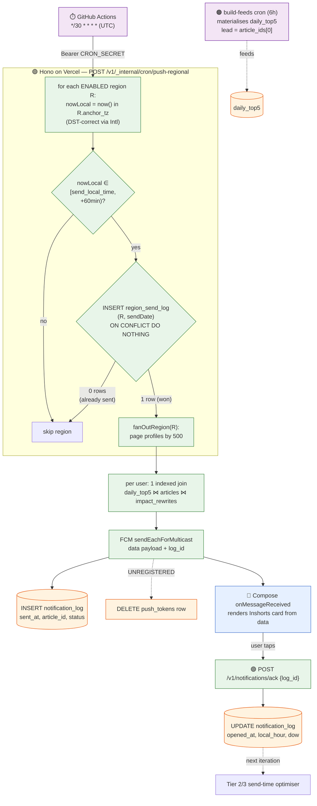

> Legend: 🟣 cron trigger · 🟢 our Hono API · 🟠 Postgres · 📱 client. Dashed edges = asynchronous / cross-iteration. The **only** decision points are the local-window check and the atomic claim; everything after the claim is a deterministic fan-out.

---

## 3. Backend Component Inventory

| Module | Path (proposed) | Responsibility |
|---|---|---|
| Regional cron handler | `src/routes/internal/push-regional.ts` | the tick: region loop, window check, atomic claim, `fanOutRegion` |
| Time/zone helpers | `src/lib/tz.ts` | `localPartsInTz`, `withinWindow`, `localHourInTz` (all `Intl`-based, DST-correct) |
| FCM dispatch | `src/lib/fcm.ts` | `firebase-admin` init, `sendDailyTop`, `pruneInvalidTokens` |
| Feed read | `src/lib/feed.ts` | `leadStoryFor(userId, date)` — the single indexed join |
| Ack route | `src/routes/notifications.ts` | `POST /v1/notifications/ack`, `PUT /v1/notifications/preferences`, `POST /v1/notifications/token` |
| Cron auth | `src/middleware/cron.ts` | `requireCron` — `timingSafeEqual` on `CRON_SECRET` (existing, reused) |
| Auth middleware | `src/middleware/auth.ts` | `requireAuth` — JWKS verify (existing, login LLD §6.2) |
| Region resolution | `supabase/migrations/*.sql` | `resolve_notif_region(country)` SQL fn + persona-write wiring |
| Migrations | `supabase/migrations/*.sql` | `profiles.notif_region`, `notification_regions`, `region_send_log`, `notification_log`, RLS |
| Schemas | `src/schemas/notifications.ts` | Zod for `ack` / `preferences` (feeds `@hono/zod-openapi`) |
| Workflow | `.github/workflows/cron-push-regional.yml` | `*/30 * * * *` (replaces `cron-push-daily.yml`) |

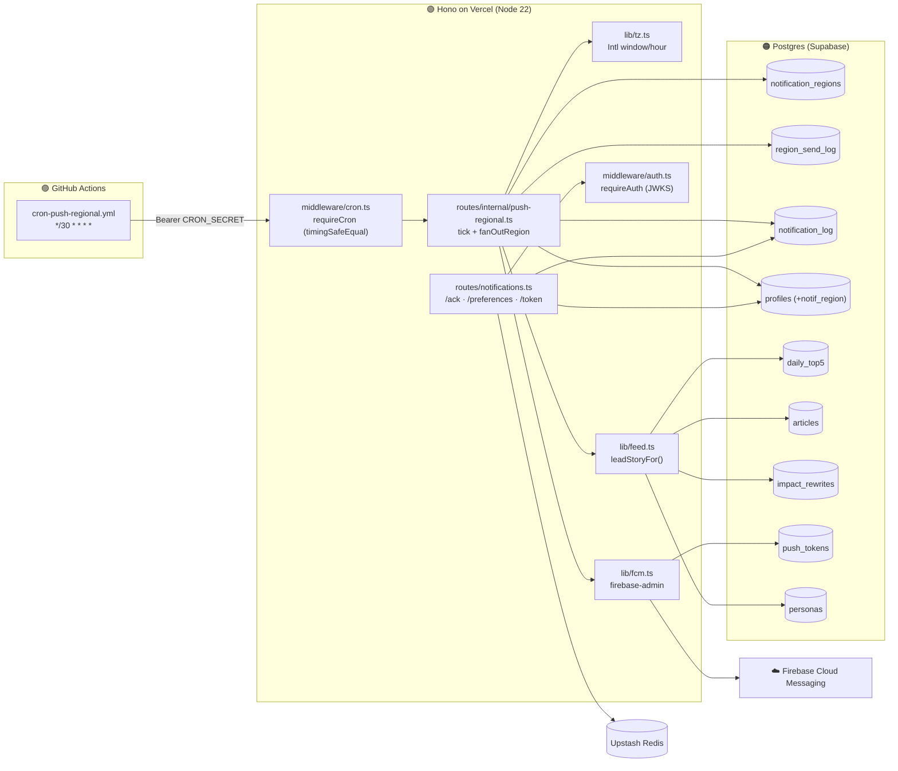

---

## 4. Data Model (concrete DDL)

All four migrations are **additive** to the foundational schema (§6.3). Existing columns reused verbatim are annotated.

### 4.1 `profiles` — add the resolved region

```sql
-- profiles already has: notifications_enabled bool default true,
--   notification_time_local time default '08:00', timezone text default 'Asia/Kolkata',
--   region_country (onboarding), is_pro (foundational §6.3 / relevant-news / onboarding).
alter table profiles
  add column notif_region text;     -- 'R1_SOUTH_ASIA_GULF' | 'R2_APAC' | 'R3_UK' | 'R4_AMERICAS'

-- MVP flips the default send time from the foundational 08:00 to evening 20:00.
alter table profiles
  alter column notification_time_local set default '20:00';

-- The hot path is "all enabled users in region R" → partial index on the predicate.
create index profiles_notif_region_idx
  on profiles (notif_region) where notifications_enabled;
```

### 4.2 `notification_regions` — the tunable config (heart of the MVP)

```sql
create table notification_regions (
  region_code     text primary key,                 -- 'R1_SOUTH_ASIA_GULF'
  display_name    text not null,
  anchor_tz       text not null,                     -- IANA, DST source of truth
  send_local_time time not null default '20:00',
  countries       text[] not null,                   -- ISO-2 list mapping into this region
  enabled         boolean not null default true
);

-- Seed: the §3.2 four-region cut for the 6-country MVP.
insert into notification_regions (region_code, display_name, anchor_tz, send_local_time, countries) values
  ('R1_SOUTH_ASIA_GULF', 'South Asia + Gulf', 'Asia/Kolkata',    '20:00', array['in','ae']),
  ('R2_APAC',            'APAC',              'Asia/Singapore',  '20:00', array['sg']),
  ('R3_UK',              'UK / Europe',       'Europe/London',   '20:00', array['gb']),
  ('R4_AMERICAS',        'Americas',          'America/New_York','20:00', array['us','ca']);
```

### 4.3 `region_send_log` — the idempotency guard

```sql
create table region_send_log (
  region_code  text not null,
  send_date    date not null,                 -- the date in the region's ANCHOR tz (not UTC)
  claimed_at   timestamptz not null default now(),
  finished_at  timestamptz,
  recipients   int not null default 0,
  primary key (region_code, send_date)        -- the conflict target that makes the send single
);
```

### 4.4 `notification_log` — per-user send + open telemetry (== clustering `notification_events`)

```sql
create table notification_log (
  id              uuid primary key default gen_random_uuid(),   -- THIS is the log_id in the FCM payload
  user_id         uuid references profiles(id) on delete cascade,
  region_code     text,
  feed_date       date not null,
  article_id      uuid,                         -- lead story sent (daily_top5.article_ids[0])
  sent_at         timestamptz not null default now(),
  fcm_message_id  text,
  delivery_status text not null default 'sent'
      check (delivery_status in ('sent','failed','token_invalid','skipped_no_feed','skipped_no_token')),
  -- open telemetry (filled by POST /v1/notifications/ack) — Tier 2/3 inputs:
  opened_at       timestamptz,
  local_hour      smallint,                     -- opened_at expressed in profiles.timezone, 0-23
  dow             smallint                      -- day-of-week 0-6
);
create index notif_log_user_idx on notification_log (user_id, sent_at desc);
create index notif_log_open_idx on notification_log (user_id, opened_at desc);
```

### 4.5 RLS

```sql
alter table notification_log enable row level security;
create policy "notiflog_self_select" on notification_log
  for select using (auth.uid() = user_id);
-- All writes to notification_log go through the service-role / cron path (RLS-bypassing).
-- notification_regions & region_send_log: NO client policy → server-only by default.
```

### 4.6 Entity map (read by the dispatch path)

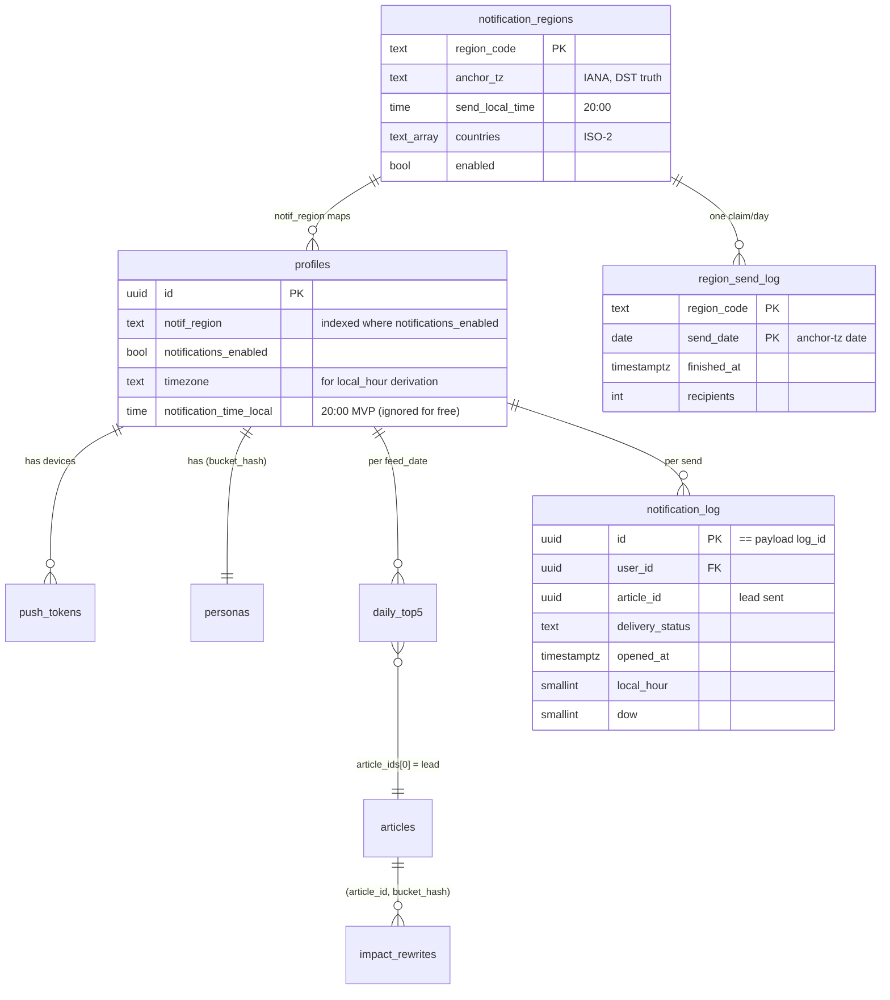

> **Why both `notification_log` and `daily_top5.push_sent_at`:** `push_sent_at` is a cheap in-row "did we push to this user today" marker (foundational §6.7); `notification_log` is the durable, analytics-grade event stream (multi-device, delivery status, **open histogram inputs**) the next iteration trains on. Both are written in the fan-out.

---

## 5. Region Resolution (country → `notif_region`)

The send query filters on `profiles.notif_region`, so the region must be **resolved and stored at persona-write time** (not computed per tick). One stable SQL function reads the config table, so editing `notification_regions.countries` is the single source of truth.

```sql
create or replace function resolve_notif_region(p_country text)
returns text language sql stable as $$
  select region_code
    from notification_regions
   where enabled and lower(p_country) = any(countries)
   limit 1;
$$;
```

Wiring (in the persona LLD's `PUT /v1/personas`, documented here as the boundary contract):

```sql
-- inside the persona upsert, after region_country is known:
update profiles
   set notif_region = resolve_notif_region(region_country)
 where id = $user_id;
```

One-time backfill for users who onboarded before this migration:

```sql
update profiles p
   set notif_region = resolve_notif_region(region_country)
 where region_country is not null and notif_region is null;
```

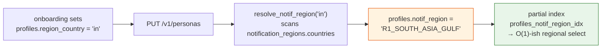

> A country **not** present in any `notification_regions.countries` resolves to `NULL` → that user is never selected by the regional send (a logged no-op, not an error). Adding a new launch country = appending to a `countries` array, then a targeted backfill — no code change.

---

## 6. Time & DST Handling (`src/lib/tz.ts`)

The entire correctness of "fire at 20:00 local, DST-safe" reduces to one helper. We use the platform `Intl.DateTimeFormat` (zero-dependency on Node 22; the ICU/IANA database ships with the runtime), formatting the **current UTC instant** into the region's anchor tz and reading back the local date + minutes-since-midnight.

```ts
// src/lib/tz.ts
export interface LocalParts { date: string; minutes: number } // date='YYYY-MM-DD', minutes 0..1439

export function localPartsInTz(tz: string, instant: Date): LocalParts {
  const fmt = new Intl.DateTimeFormat('en-CA', {            // en-CA → YYYY-MM-DD ordering
    timeZone: tz, hour12: false,
    year: 'numeric', month: '2-digit', day: '2-digit',
    hour: '2-digit', minute: '2-digit',
  });
  const p = Object.fromEntries(fmt.formatToParts(instant).map((x) => [x.type, x.value]));
  const hour = Number(p.hour) % 24;                          // some ICU builds emit '24' at midnight
  return { date: `${p.year}-${p.month}-${p.day}`, minutes: hour * 60 + Number(p.minute) };
}

// target='20:00' → 1200. Window is [target, target+windowMin) on the LOCAL clock.
export function withinWindow(local: LocalParts, target: string, windowMin: number): boolean {
  const [h, m] = target.split(':').map(Number);
  const t = h * 60 + m;
  return local.minutes >= t && local.minutes < t + windowMin;
}

// open-time bucket for telemetry: hour-of-day in the user's own tz, 0..23.
export function localHourInTz(tz: string, instant: Date): number {
  return localPartsInTz(tz, instant).minutes / 60 | 0;
}
```

**Why this is DST-correct without touching cron:** `Intl` resolves `'Europe/London'` against the IANA rules at the *instant* given, so the same `send_local_time='20:00'` maps to a different UTC instant in BST vs GMT automatically. The cron expression stays `*/30 * * * *` forever.

### 6.1 Region fire-instant reference (computed, not configured)

| Region | Anchor tz | Local 20:00 → UTC (standard) | → UTC (DST) | Which `*/30` tick fires it |
|---|---|---|---|---|
| R1 South Asia+Gulf | `Asia/Kolkata` (no DST) | **14:30 UTC** | — | the `14:30` tick |
| R2 APAC | `Asia/Singapore` (no DST) | **12:00 UTC** | — | the `12:00` tick |
| R3 UK | `Europe/London` | **20:00 UTC** (GMT) | **19:00 UTC** (BST) | the `20:00` / `19:00` tick |
| R4 Americas | `America/New_York` | **01:00 UTC** (EST) | **00:00 UTC** (EDT) | the `01:00` / `00:00` tick |

```mermaid
gantt
    title One UTC day — which 30-min tick claims each region (DST-shifting ones shown at both)
    dateFormat HH:mm
    axisFormat %H:%M
    section R2 APAC (SGT)
    fire @12:00 UTC          :crit, 12:00, 30m
    section R1 S.Asia+Gulf (IST)
    fire @14:30 UTC          :crit, 14:30, 30m
    section R3 UK (BST/GMT)
    fire @19:00 UTC (BST)    :active, 19:00, 30m
    fire @20:00 UTC (GMT)    :20:00, 30m
    section R4 Americas (EDT/EST)
    fire @00:00 UTC (EDT)    :active, 00:00, 30m
    fire @01:00 UTC (EST)    :01:00, 30m
```

> The four regions fire at four very different UTC instants — so the `build-feeds` (6 h) cron always has a fresh `daily_top5` before the earliest fire (R2 @ 12:00 UTC), as long as the build job completes before 12:00 UTC (HLD §5.2; open item §13.2).

---

## 7. The Scheduler Tick (`POST /v1/_internal/cron/push-regional`)

`CRON_SECRET`-protected (`requireCron`, `timingSafeEqual` — foundational §9.4, reused unchanged). Replaces the retired `push-daily` endpoint.

### 7.1 Tick decision flow

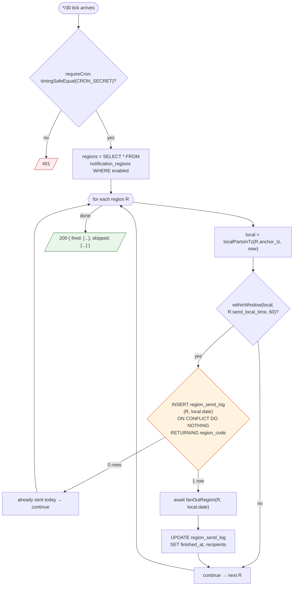

### 7.2 Handler

```ts
// src/routes/internal/push-regional.ts
import { requireCron } from '../../middleware/cron';
import { localPartsInTz, withinWindow } from '../../lib/tz';
import { fanOutRegion } from '../../lib/fcm';

const SEND_WINDOW_MIN = 60; // wider than the 30-min cron interval; idempotency makes it safe (§5.3)

app.post('/v1/_internal/cron/push-regional', requireCron, async (c) => {
  const now = new Date();
  const regions = await db.notification_regions.where({ enabled: true });
  const fired: string[] = [], skipped: string[] = [];

  for (const r of regions) {
    const local = localPartsInTz(r.anchor_tz, now);            // DST-correct
    if (!withinWindow(local, r.send_local_time, SEND_WINDOW_MIN)) { skipped.push(r.region_code); continue; }

    // ATOMIC CLAIM — only the first tick in the window wins (§5.3 idempotency level 1).
    const claimed = await db.query(
      `insert into region_send_log (region_code, send_date)
       values ($1, $2) on conflict do nothing returning region_code`,
      [r.region_code, local.date],                              // date in the region's ANCHOR tz
    );
    if (claimed.rows.length === 0) { skipped.push(`${r.region_code}(done)`); continue; }

    const recipients = await fanOutRegion(r, local.date);
    await db.region_send_log.update(
      { region_code: r.region_code, send_date: local.date },
      { finished_at: new Date(), recipients },
    );
    fired.push(r.region_code);
  }
  return c.json({ fired, skipped });   // 200 — observable, idempotent
});
```

### 7.3 `fanOutRegion` — paged dispatch

Paged at 500 users to bound Vercel function memory (2 GB / 300 s — foundational §4.2). At ~1,500 devices the slowest region completes in seconds.

```ts
// src/lib/fcm.ts
import { leadStoryFor } from './feed';

export async function fanOutRegion(r, sendDate: string): Promise<number> {
  let recipients = 0;
  for await (const page of db.profiles.pageBy(500, {
    notif_region: r.region_code, notifications_enabled: true,
  })) {
    for (const u of page) {
      const logId = crypto.randomUUID();                       // pre-generated → shipped in payload (§8)
      const lead  = await leadStoryFor(u.id, sendDate);        // single indexed join (§8.1)
      if (!lead) {                                             // no feed yet (cold-start §7.3)
        await db.notification_log.insert({
          id: logId, user_id: u.id, region_code: r.region_code,
          feed_date: sendDate, delivery_status: 'skipped_no_feed',
        });
        continue;
      }
      const tokens = await db.push_tokens.forUser(u.id);
      if (tokens.length === 0) {
        await db.notification_log.insert({
          id: logId, user_id: u.id, region_code: r.region_code, feed_date: sendDate,
          article_id: lead.article_id, delivery_status: 'skipped_no_token',
        });
        continue;
      }

      const resp = await sendDailyTop(tokens, { logId, lead });   // §8.2
      await db.notification_log.insert({
        id: logId, user_id: u.id, region_code: r.region_code, feed_date: sendDate,
        article_id: lead.article_id, fcm_message_id: resp.responses[0]?.messageId,
        delivery_status: resp.successCount > 0 ? 'sent' : 'failed',
      });
      await db.daily_top5.update({ user_id: u.id, feed_date: sendDate }, { push_sent_at: new Date() });
      await pruneInvalidTokens(resp, tokens);                    // §8.3
      recipients++;
    }
  }
  return recipients;
}
```

---

## 8. FCM Dispatch & Lead-Story Assembly

### 8.1 The lead-story query (`src/lib/feed.ts`)

One indexed read. **Postgres arrays are 1-indexed**, so `article_ids[1]` is the lead (`daily_top5[0]` in zero-indexed prose). `COALESCE` keeps a cold-start (`is_partial`) feed sendable with the original headline.

```ts
export async function leadStoryFor(userId: string, feedDate: string) {
  const rows = await db.query(`
    select
      d.article_ids[1]                          as article_id,   -- [1] = lead (1-indexed)
      coalesce(ir.impact_headline, a.headline)  as headline,
      coalesce(ir.why_summary, a.summary)       as summary,
      d.is_partial
    from daily_top5 d
    join articles  a on a.id = d.article_ids[1]
    join personas  p on p.user_id = d.user_id
    left join impact_rewrites ir
      on ir.article_id = d.article_ids[1]
     and ir.persona_bucket_hash = p.bucket_hash
    where d.user_id = $1 and d.feed_date = $2
    limit 1
  `, [userId, feedDate]);
  return rows.rows[0] ?? null;   // null ⇒ no feed today ⇒ skipped_no_feed
}
```

### 8.2 `sendDailyTop` — `data` multicast

```ts
import admin from 'firebase-admin';  // init from FCM v1 service-account JSON (foundational §15)

export async function sendDailyTop(tokens: string[], { logId, lead }) {
  return admin.messaging().sendEachForMulticast({
    tokens,
    data: {                          // DATA payload — all values MUST be strings
      type: 'daily_top',
      log_id: logId,                 // echoed back on tap → /ack
      article_id: String(lead.article_id),
      headline: lead.headline ?? '',
      summary: lead.summary ?? '',
    },
    android: { priority: 'high', notification: { channelId: 'daily_top' } },
  });
}
```

> **`data` not `notification`:** the backgrounded Compose `onMessageReceived` renders the Inshorts-style card from the payload (+ locally cached `daily_top5`), identical to opening the app (foundational §6.7, §11). Per FCM contract, `data` values are `string`-only — `article_id` is stringified, nulls coalesced to `''`.

### 8.3 `pruneInvalidTokens` — reactive cleanup (no separate cron)

```ts
const DEAD = new Set([
  'messaging/registration-token-not-registered',
  'messaging/invalid-argument',
]);

export async function pruneInvalidTokens(resp, tokens: string[]) {
  await Promise.all(resp.responses.map((res, i) =>
    !res.success && DEAD.has(res.error?.code)
      ? db.push_tokens.deleteByToken(tokens[i])
      : null));
}
```

### 8.4 Notification-row lifecycle

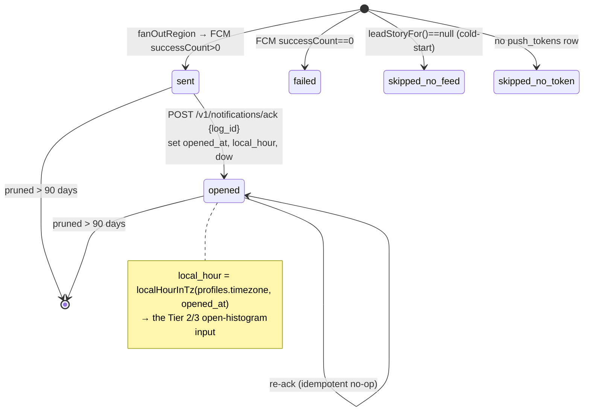

---

## 9. API Surface

> Auth unchanged: client uses Supabase Auth directly; our Hono API only **verifies** the JWT (JWKS, cached 1 h) and reads `sub`. We mint no tokens. (login LLD §6.)

### 9.1 `POST /v1/notifications/token` — UNCHANGED (foundational §7)
Register/refresh an FCM device token. No change.

### 9.2 `PUT /v1/notifications/preferences` — narrowed for MVP

```ts
const PrefsRequest = z.object({
  notifications_enabled: z.boolean().optional(),
  timezone: z.string().optional(),                 // e.g. 'Asia/Kolkata'
  notification_time_local: z.string().optional(),  // accepted, IGNORED for free users (MVP)
});
```

- Only `notifications_enabled` + `timezone` take effect for free users. `notification_time_local` is **accepted but ignored** (region-derived 20:00 is authoritative); honoured later for Pro/Tier-3. `timezone` still persists — it is the basis for the `local_hour` open-bucket today, and per-user timing next iteration.
- RLS-client update keyed on `auth.uid()=id`. `204` on success.

### 9.3 `POST /v1/notifications/ack` — NEW (the open-capture hook)

The single endpoint that makes Tier 2/3 possible. Client calls it when the user **taps** the push, echoing the `log_id` from the `data` payload.

```ts
const AckRequest = z.object({ log_id: z.string().uuid() });

notifications.post('/ack', requireAuth, rateLimit('ack', '10/10s'), async (c) => {
  const { userId } = c.get('auth');
  const { log_id } = AckRequest.parse(await c.req.json());

  // ownership + idempotency in one guarded write: only the owner's still-unopened row updates.
  const tz = await db.profiles.timezoneOf(userId);            // for local_hour
  const now = new Date();
  const updated = await db.query(`
    update notification_log
       set opened_at = $1,
           local_hour = $2,
           dow = $3
     where id = $4 and user_id = $5 and opened_at is null
     returning id
  `, [now, localHourInTz(tz, now), now.getUTCDay(), log_id, userId]);

  // 204 whether it updated (first ack) or not (re-ack / not-owner) — never leak existence.
  return c.body(null, 204);
});
```

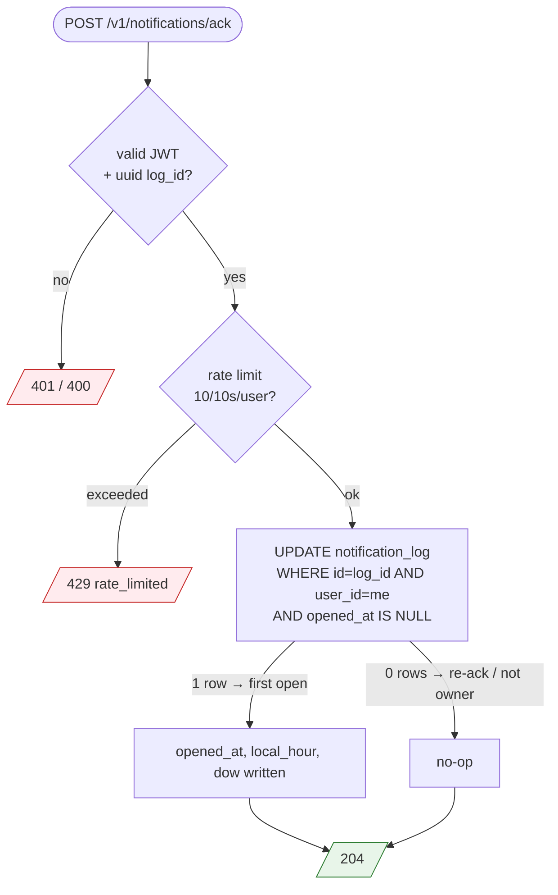

> **Why the `opened_at IS NULL AND user_id = me` predicate does all three jobs:** ownership (wrong user → 0 rows), idempotency (already opened → 0 rows), and first-write-wins — without a separate `SELECT`. Always `204` so the endpoint never reveals whether a `log_id` exists (anti-enumeration). Rate-limited to stop open-event spoofing that would poison the next iteration's histogram (HLD §11).

### 9.4 Internal cron — `POST /v1/_internal/cron/push-regional`
`requireCron` (§7). Replaces `push-daily`. Workflow:

```yaml
# .github/workflows/cron-push-regional.yml  (replaces cron-push-daily.yml)
on:
  schedule: [{ cron: '*/30 * * * *' }]   # every 30 min UTC; handler decides which regions fire
  workflow_dispatch: {}
jobs:
  push:
    runs-on: ubuntu-latest
    steps:
      - run: |
          curl -fsS -X POST https://api.sowhat.app/v1/_internal/cron/push-regional \
               -H "Authorization: Bearer ${{ secrets.CRON_SECRET }}" --max-time 280
```

---

## 10. Idempotency Model (three levels)

The system sends **exactly one push per user per day** under retries, overlapping ticks, and GitHub Actions delivering a cron tick more than once.

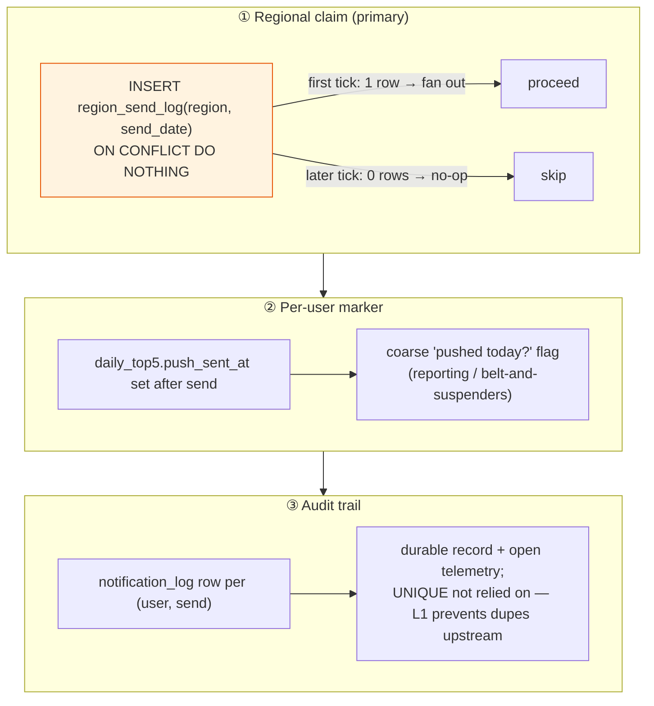

| Level | Mechanism | Guarantees |
|---|---|---|
| ① Regional | `region_send_log` PK `(region_code, send_date)` + `ON CONFLICT DO NOTHING` | no duplicate **regional** fan-out, even with overlapping/wide-window ticks |
| ② Per-user | `daily_top5.push_sent_at` | cheap in-row "already pushed today" marker |
| ③ Audit | `notification_log` | durable per-send event stream; the `/ack` `opened_at IS NULL` guard makes opens idempotent too |

> The wide `[target, target+60min)` window (§5.3) is **only safe because of level ①**: multiple ticks may enter the window, but only the first wins the claim. A dropped/late GitHub Actions tick is caught by the next one within the hour.

---

## 11. Sequence Flows

### 11.1 Steady state — India user, 20:00 IST

```mermaid
sequenceDiagram
    autonumber
    participant GHA as ⏱️ GH Actions
    participant API as 🟢 push-regional
    participant DB as 🟠 Postgres
    participant FB as ☁️ FCM
    participant App as 📱 App

    Note over DB: build-feeds (6h) already materialised daily_top5(U, today)
    GHA->>API: POST push-regional (14:30 UTC tick)
    API->>API: localPartsInTz('Asia/Kolkata') → 20:00 → in window
    API->>DB: INSERT region_send_log('R1', 2026-06-12) ON CONFLICT DO NOTHING
    DB-->>API: 1 row (claim won)
    loop pageBy(500) WHERE notif_region='R1' AND notifications_enabled
        API->>DB: leadStoryFor(U) → article_ids[1] ⋈ articles ⋈ impact_rewrites
        API->>FB: sendEachForMulticast(data{log_id, headline, summary})
        API->>DB: INSERT notification_log(U,'R1',article_id,'sent'); push_sent_at=now
    end
    API->>DB: UPDATE region_send_log finished_at, recipients
    FB-->>App: data push → onMessageReceived renders card
    App->>API: POST /v1/notifications/ack {log_id}
    API->>DB: UPDATE notification_log opened_at, local_hour=20, dow
    Note over GHA,API: 15:00 UTC tick → claim conflict → no-op (idempotent)
```

### 11.2 DST boundary — UK user (R3)

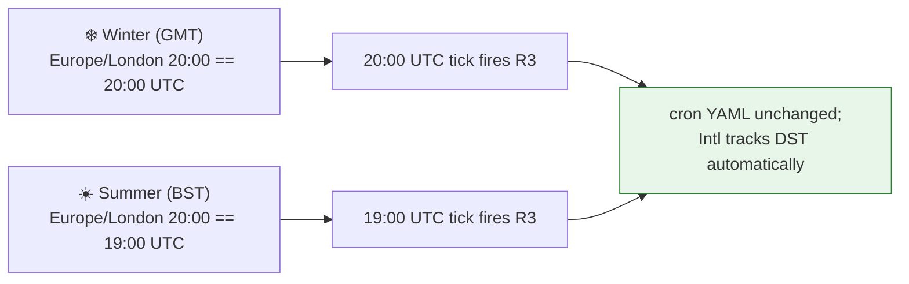

### 11.3 User disables notifications

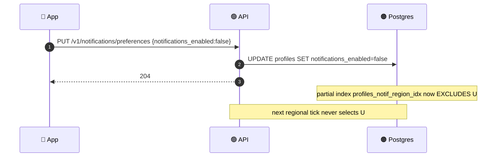

### 11.4 Stale device token

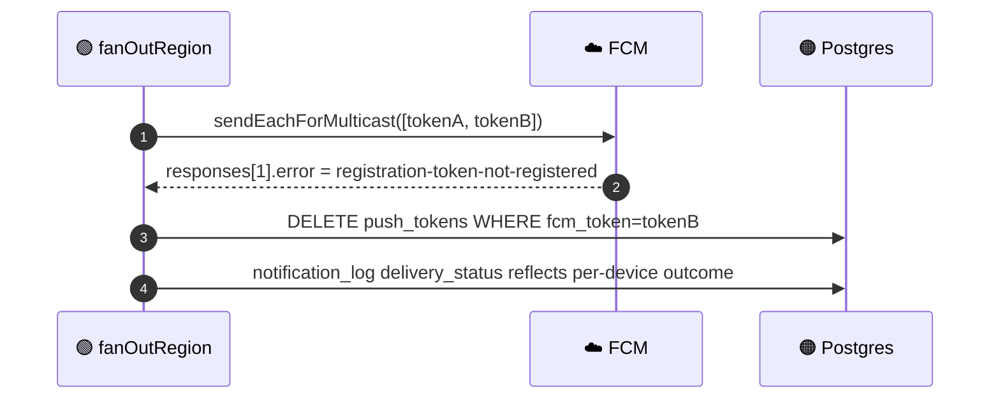

---

## 12. What We Capture Now for the Next Iteration

The explicit "keep data in DB for next iteration" requirement. Every column below is collected day 1; nothing in the next iteration requires backfilling historical sends.

| Captured now | Column / source | Powers (next iteration — clustering §6.2) |
|---|---|---|
| send baseline | `notification_log.sent_at` + `delivery_status` | open-rate denominator; deliverability monitoring |
| **open event** | `notification_log.opened_at` (via `/ack`) | open-rate — the core optimisation target |
| **open hour (user tz)** | `notification_log.local_hour` | **Tier 2** population best-hour + **Tier 3** per-user open histogram |
| day-of-week | `notification_log.dow` | day-of-week effect |
| content opened | `notification_log.article_id` | content recommendation (which lead stories get opened) |
| region | `notification_log.region_code` | region-level open-rate, the unit Tier 2 optimises within |
| segment | `profiles.timezone`, persona `age_range × employment_type` | **Tier 1** segment prior |

**Next iteration adds (NOT now — keeps the MVP schema minimal):**

```sql
-- clustering §6.5 — added in the NEXT iteration, consuming the history captured above:
alter table profiles
  add column send_time_tier  smallint not null default 1,   -- 0=global,1=segment,2=pop,3=user
  add column resolved_send_local time,
  add column next_send_at timestamptz;                       -- Tier 3 absolute UTC, 1-min scanner
```

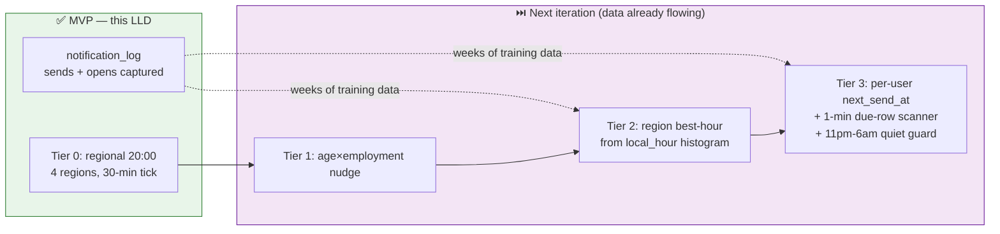

---

## 13. Error Model & Open Questions

### 13.1 Error model

| Endpoint | HTTP | `code` | Cause |
|---|---|---|---|
| `push-regional` | 401 | — | `CRON_SECRET` mismatch (`timingSafeEqual`) |
| `push-regional` | 200 | — | always (returns `{fired, skipped}`); per-user failures recorded in `notification_log`, never thrown |
| `/ack` | 400 | `invalid_body` | `log_id` not a uuid |
| `/ack` | 401 | `invalid_token` | bad/missing JWT |
| `/ack` | 429 | `rate_limited` | Upstash window exceeded |
| `/ack` | 204 | — | recorded **or** idempotent no-op (never reveals row existence) |
| `/preferences` | 204 | — | updated |

`delivery_status` enum on `notification_log` is the per-user outcome ledger: `sent` · `failed` · `token_invalid` · `skipped_no_feed` · `skipped_no_token`.

### 13.2 Open questions / ⟳ runtime confirmations

1. **GitHub Actions tick reliability** ⟳ — Actions cron can skip or delay ticks under load. The `[target, +60min)` window + idempotent claim (§5.3, §10) absorbs single misses; confirm at runtime that two consecutive ticks are never both dropped within a region's window, else add a catch-up sweep.
2. **`build-feeds` completes before 12:00 UTC** ⟳ — the earliest regional fire (R2/APAC). Verify the 6 h `build-feeds` schedule offset so `daily_top5` is fresh (HLD §5.2).
3. **Client reliably calls `/ack` from a killed-app notification tap** ⟳ — confirm the Compose tap-intent fires the ack even cold-started; otherwise open-rate (and Tier 2/3) is undercounted (HLD §13.8).
4. **Americas anchored to Eastern** ⟳ — West-coast users get ~17:00 local. Confirm acceptable or split `R4` into East/West (one config row, HLD §3.2 / Decision 4).
5. **`'24'` hour edge in `Intl`** ⟳ — the `% 24` guard handles ICU builds that emit `'24'` at local midnight; verify against the deployed Node 22 ICU build (none of the four anchors fire near midnight, so low risk).
6. **90-day retention job** — fold `delete from notification_log where sent_at < now() - interval '90 days'` into an existing nightly cleanup cron (clustering §6.5).

---

## 14. Security, Abuse & Configuration

| Control | Layer | Spec |
|---|---|---|
| Cron auth | Backend | `Authorization: Bearer ${CRON_SECRET}` via `crypto.timingSafeEqual` (foundational §9.4, §13.2) |
| `/ack` ownership | Backend + RLS | `notification_log.user_id = auth.uid()` enforced in the `UPDATE … WHERE user_id=$me` predicate + RLS select policy |
| `/ack` spoofing | Backend | Upstash sliding window **10 req / 10 s / user** (foundational §13.3) — protects histogram integrity |
| No PII in payload | FCM | `data` carries `article_id`, random `log_id` (UUID, not a user id), anonymous headline/summary — no email/user_id (foundational §13.1) |
| Token hygiene | Backend | stale tokens pruned reactively (§8.3); `push_tokens` never logged cleartext (foundational §13.3) |
| Quiet-by-design | System | exactly one push/user/day; idempotent claim → no retry storms |
| Region/log tables | DB | `notification_regions` + `region_send_log` server-only (no RLS client policy) |

**Env vars (additions):** `CRON_SECRET` (existing), FCM v1 service-account JSON (`FIREBASE_SERVICE_ACCOUNT` or `GOOGLE_APPLICATION_CREDENTIALS`), `SUPABASE_SERVICE_ROLE_KEY` (existing, for cron-path writes), Upstash REST URL/token (existing).

**Free-tier fit (foundational §4):** FCM free (4 regional sends × hundreds of devices ≪ 600 K/min quota) · GH Actions 48 sub-second `curl`s/day · Vercel I/O-bound handler paged at 500, well under 300 s · `notification_log` ≈ 1,500 rows/day × ~150 B × 90 days ≈ **~20 MB** of the 500 MB Postgres budget. No new vendor, no paid tier.

---

## 15. Build Order & Test Matrix

### 15.1 Build order

1. **Migrations §4** — `profiles.notif_region` (+ partial index, `notification_time_local` default → `'20:00'`), `notification_regions` (seed 4 rows), `region_send_log`, `notification_log` (+ indexes + RLS).
2. **`resolve_notif_region` fn §5** + wire into `PUT /v1/personas` + one-time backfill.
3. **`src/lib/tz.ts` §6** — `localPartsInTz` / `withinWindow` / `localHourInTz`; unit-test against IST (no DST), London (BST↔GMT), New York (EDT↔EST).
4. **`src/lib/feed.ts` §8.1** — `leadStoryFor` join (1-indexed array, COALESCE fallback).
5. **`src/lib/fcm.ts` §8** — `firebase-admin` init, `sendDailyTop`, `pruneInvalidTokens`, `fanOutRegion` (paged).
6. **`POST /v1/_internal/cron/push-regional` §7** — `requireCron`, window check, atomic claim, fan-out.
7. **`.github/workflows/cron-push-regional.yml`** (`*/30 * * * *`); **retire** `cron-push-daily.yml`.
8. **`POST /v1/notifications/ack` §9.3** — idempotent guarded UPDATE + rate limit; **`PUT /preferences` §9.2** narrowed.
9. **Retention** — fold 90-day `notification_log` prune into nightly cleanup cron.
10. **(Next iteration)** Tier 1/2/3 columns + scanner on the captured history (clustering §6.2–§6.5).

### 15.2 Test matrix (essentials)

| Case | Expect |
|---|---|
| Tick at 14:30 UTC, R1 enabled, feed exists | claim won; FCM `data` push; `notification_log('sent')`; `push_sent_at` set |
| Second tick at 15:00 UTC same day, R1 | claim conflict → 0 rows → no-op |
| London tick 19:00 UTC in summer (BST) | `withinWindow` true (local 20:00); R3 fires |
| London tick 20:00 UTC in summer (BST) | local 21:00 → out of window → skip |
| User `notifications_enabled=false` | excluded by partial index; no `notification_log` row |
| User with no `daily_top5` (cold-start) | `notification_log('skipped_no_feed')`; no FCM call |
| User with no `push_tokens` | `notification_log('skipped_no_token')` |
| FCM returns `registration-token-not-registered` for one device | that `push_tokens` row deleted; row recorded |
| `/ack` first call, owner | 204; `opened_at`/`local_hour`/`dow` written |
| `/ack` re-call same `log_id` | 204; no second write (idempotent) |
| `/ack` for another user's `log_id` | 204; 0 rows updated (no leak) |
| `/ack` 11th call in 10 s | 429 `rate_limited` |
| `push-regional` without `CRON_SECRET` | 401 |
| Country not in any `countries[]` | `notif_region=NULL`; never selected |

---

## 16. Sources

This LLD derives entirely from the four internal HLD/architecture docs cited under **Builds on**. External mechanics (verify against live SDK at build time):
- FCM `sendEachForMulticast` / `data` messages / error codes (`registration-token-not-registered`, `invalid-argument`): <https://firebase.google.com/docs/cloud-messaging/send-message>
- FCM quotas (free, 600 K msgs/min project quota): <https://firebase.google.com/docs/cloud-messaging/throttling-and-quotas>
- FCM recipient-tz scheduling unreliable → own the scheduler: <https://github.com/firebase/firebase-ios-sdk/issues/8172>
- `Intl.DateTimeFormat` `timeZone` / `formatToParts` (IANA/DST resolution): <https://developer.mozilla.org/en-US/docs/Web/JavaScript/Reference/Global_Objects/Intl/DateTimeFormat>
- IANA Time Zone Database (DST rules): <https://www.iana.org/time-zones>
- Production scheduled-push pattern (cron + idempotent atomic claim): <https://dev.to/sangwoo_rhie/building-a-production-ready-scheduled-push-notification-system-with-nestjs-cron-and-firebase-4fai>
- Send-time-optimisation payoff (next iteration): OneSignal Intelligent Delivery <https://onesignal.com/blog/increase-open-rates-by-up-to-23-percent-with-intelligent-delivery/>

---
