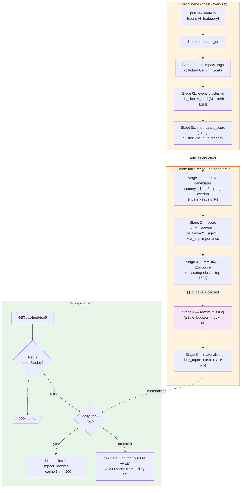
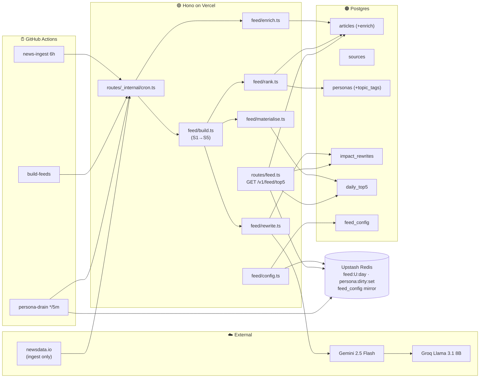
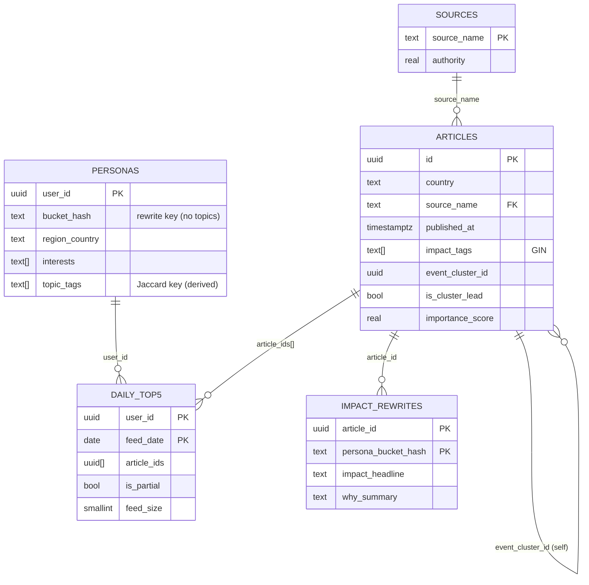
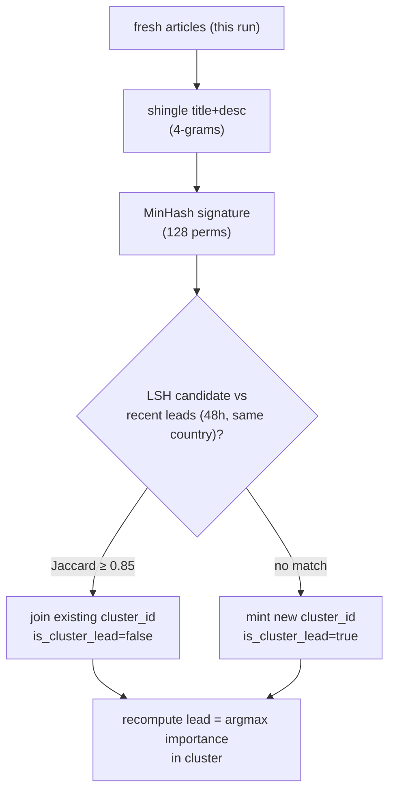
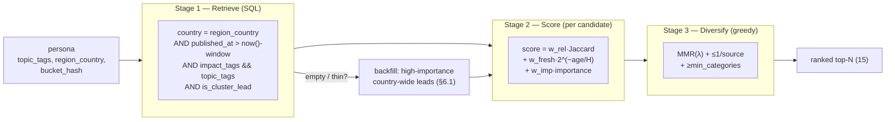
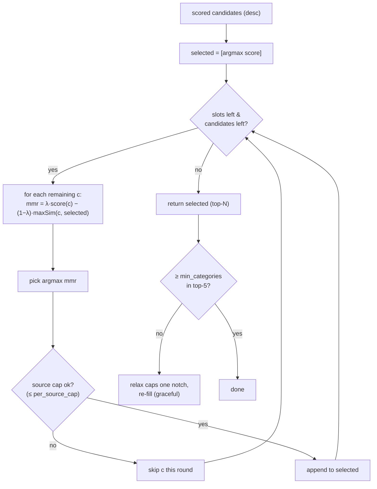
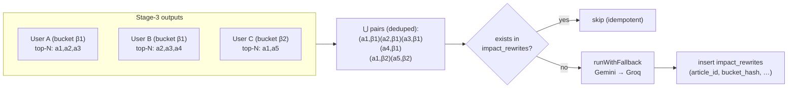
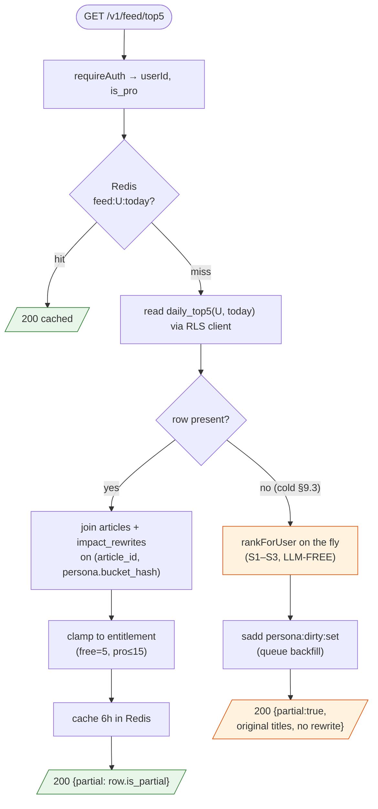
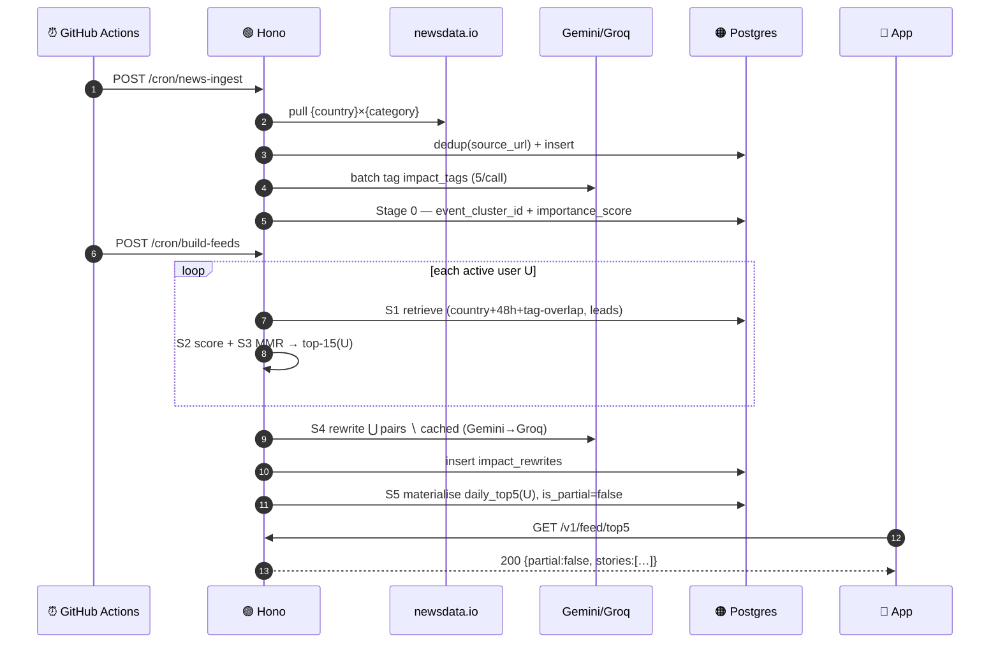

# LLD: SoWhat News — Relevant News for a Persona (Backend)

**Date**: 2026-06-12 19:06 IST
**Researcher**: Anjay Sahoo
**Git Commit**: `d972536720dd7da6d09cbb18d3d6bb3b9103342f`
**Branch**: `master`
**Repository**: so-what-news-app
**Scope**: **Backend only.** The Compose Multiplatform client appears only where it drives a backend contract (the `partial=true` poll, the `limit` clamp). This LLD takes the HLD's five-stage pipeline down to the level of modules, function signatures, SQL, scoring math, Redis keys, and cron wiring an engineer can implement directly.

**Builds on**:
- [`2026-06-10-sowhat-news-relevant-news-for-a-persona-hld.md`](./2026-06-10-sowhat-news-relevant-news-for-a-persona-hld.md) — the HLD this LLD implements: the two-tier fan-out (per-user *selection*, per-bucket *rewrite*), Stages 0–5, the cold-start `partial=true` path, the data-model deltas (§8), and the resolved-decision that the rewrite fan-out set = *the union of what ranks* (§6.1).
- [`2026-05-26-sowhat-news-mvp-tech-stack-architecture.md`](./2026-05-26-sowhat-news-mvp-tech-stack-architecture.md) — stack & contracts: Node 22 + Hono on Vercel, Supabase Postgres + Auth (RS256 JWT, JWKS cached 1h), Upstash Redis, Gemini 2.5 Flash → Groq Llama 3.1 8B fallback, GitHub Actions cron, the `articles`/`personas`/`impact_rewrites`/`daily_top5` base schema (§6.3), the ingestion pipeline (§6.4), the read path (§6.5), `persona:dirty:set` drain (§6.6), the LLM budget math (§5.2), `runWithFallback` (§10).
- [`2026-06-08-sowhat-news-user-clustering-and-notification-timing.md`](./2026-06-08-sowhat-news-user-clustering-and-notification-timing.md) — the 3-layer model and the load-bearing invariant: **`bucket_hash` excludes topics**, so *selection* is per-user and *rewrite* is per-bucket (§5.3–5.4).
- [`2026-06-12-sowhat-news-login-lld.md`](./2026-06-12-sowhat-news-login-lld.md) — sibling LLD for the auth layer; this LLD reuses its `requireAuth` middleware, `AppError` envelope, `rlsClient`/`serviceClient` factories, and consumes the `personas` row login + onboarding seed.

> This LLD answers: **"Given the relevant-news HLD, exactly what does the backend implement — what modules, what SQL, what scoring functions, what cron endpoints, what Redis keys, and in what order — to turn ingested articles + a persona into a ranked, reframed daily top-5?"**

---

## 1. Research Question

> Produce the **Low-Level Design for the backend relevant-news path** from the HLD: the Stage-0 enrichment functions (event clustering + importance), the Stage 1–3 per-user ranker (retrieval → weighted score → MMR/dedup/caps), the Stage-4 per-bucket impact-rewrite fan-out scoped to *what ranks*, the Stage-5 `daily_top5` materialisation, the `GET /v1/feed/top5` read path with its cold-start `partial=true` branch, the three cron endpoints that drive it, the data-model migrations, the tunable `feed_config`, and the error/budget envelope. Specify it at the level an engineer can implement directly.

---

## 2. TL;DR — LLD Decisions

1. **Five stages, two cardinalities, one pipeline module.** `buildFeeds(userSet)` runs Stages 1→5 for a set of users; the only difference between the full cron and the persona-drain cron is *which* user set is passed in. Stage 0 lives in the ingest job (per article). Stage 4 (LLM) is the only expensive stage and is deduplicated to **`(article_id, bucket_hash)` pairs that actually rank** — never the full cross-product. (HLD §2, §6.1.)
2. **Selection is LLM-free and deterministic; only reframing touches the LLM.** Stages 1–3 are pure scoring (Jaccard + half-life decay + importance, then MMR), so a brand-new user gets a *relevance-ranked* feed synchronously even before any rewrite exists. The LLM (`runWithFallback`, stack §10) appears only in Stage 4. (HLD §5, §12 Decision 1.)
3. **The fan-out set is computed, not predicated.** The HLD retired the prior doc's loose `bucketMatchesTags`. This LLD computes `pairs = ⋃_U {(a, U.bucket_hash) : a ∈ top-N(U)} \ already_cached`, a set-builder over Stage-3 outputs, idempotent on the `impact_rewrites` PK. (HLD §6.1.)
4. **The read path is one DB read + Redis, never the LLM or news API.** `GET /v1/feed/top5` is a Redis read-through over the materialised `daily_top5` joined to `articles` + `impact_rewrites` on `(article_id, persona.bucket_hash)`. Cold/empty `daily_top5` → run Stages 1–3 on the fly (LLM-free) and return `partial=true`. (HLD §7.2–7.3.)
5. **All tunables are server-driven `feed_config`, not constants.** `{w_rel, w_fresh, w_imp, H, freshness_window_h, mmr_lambda, per_source_cap, min_categories, candidate_pool_n}` live in a single-row config table mirrored to Redis, so editorial re-tuning needs no deploy. (HLD §5.2, §8 RLS note, §12 Decision 4.)
6. **Three enrichment columns are computed once per article at ingest**, never per user: `event_cluster_id` + `is_cluster_lead` (MinHash-LSH lexical dedup), `importance_score` (`norm((1+log cluster_size)·authority·recency)`). (HLD §4, §8.1.)



> Legend: 🟠 cron-only work (GitHub Actions) · 🟣 the single LLM stage · 🟢 request path (no LLM, no news API). The crux: **selection (B1–B3) diverges per user; reframing (B4) converges per bucket.**

---

## 3. Backend Component Inventory

| Module | Path (proposed) | Responsibility | HLD ref |
|---|---|---|---|
| Enrichment | `src/feed/enrich.ts` | Stage 0: `clusterEvents()`, `computeImportance()` | §4 |
| Ranker | `src/feed/rank.ts` | Stages 1–3: `retrieveCandidates()`, `scoreCandidate()`, `mmrRerank()` | §5 |
| Rewrite fan-out | `src/feed/rewrite.ts` | Stage 4: `pairsToRewrite()`, `rewriteMissing()` (wraps stack §10 `runWithFallback`) | §6 |
| Materialiser | `src/feed/materialise.ts` | Stage 5: `materialiseDailyTop5()` | §7.1 |
| Pipeline orchestrator | `src/feed/build.ts` | `buildFeeds(userSet)` = S1→S5; reused by both crons | §10.1 |
| Read route | `src/routes/feed.ts` | `GET /v1/feed/top5` (read-through + cold-start) | §7.2–7.3 |
| Cron routes | `src/routes/_internal/cron.ts` | `news-ingest`, `build-feeds`, `persona-drain` | §9.2 |
| Config | `src/feed/config.ts` | load/cache `feed_config` (Redis-mirrored) | §5.2 |
| Tag mapping | `src/feed/tags.ts` | `interests[] → topic_tags[]` (impact_tags taxonomy) | clustering §5.4 |
| Migrations | `supabase/migrations/*.sql` | §5 DDL deltas | §8 |
| Schemas | `src/schemas/feed.ts` | `ImpactStory`, `FeedResponse` Zod (→ OpenAPI) | §9.1 |

Reused from the **login LLD**: `requireAuth` (`src/middleware/auth.ts`), `AppError` (`src/lib/errors.ts`), `rlsClient`/`serviceClient` (`src/lib/supabase.ts`), Upstash wrappers (`src/lib/ratelimit.ts`).



---

## 4. Data Model — DDL (HLD §8, base tables stack §6.3)

```sql
-- 4.1 articles: Stage-0 enrichment columns (HLD §8.1). Base table = stack §6.3.
alter table articles
  add column event_cluster_id uuid,                       -- same-event grouping (§4.1)
  add column is_cluster_lead  boolean not null default true, -- representative of its cluster
  add column importance_score real not null default 0.0,  -- §4.2, normalised 0..1
  add column embedding vector(384);                        -- Phase 2 only (pgvector), else null
create index articles_cluster_idx     on articles (event_cluster_id);
create index articles_importance_idx  on articles (importance_score desc);
-- load-bearing existing: source_url(unique), country, published_at,
--   impact_tags(GIN articles_tags_idx), articles_country_idx, articles_published_idx.

-- 4.2 sources: precomputed authority weights (small hand-seeded table; §4.2)
create table sources (
  source_name text primary key,
  authority   real not null default 0.5,   -- 0..1, hand-seeded then tuned
  country     text
);

-- 4.3 personas.topic_tags: derived tag set for Jaccard ranking (clustering §5.4).
--     Written by PUT /v1/personas (onboarding LLD boundary).
alter table personas
  add column topic_tags text[] not null default '{}';
create index personas_topic_tags_idx on personas using gin (topic_tags);

-- 4.4 daily_top5: Pro size, ranking provenance, partial state (§8.3).
alter table daily_top5
  add column is_partial boolean not null default false,  -- true until rewrites backfilled (§7.3)
  add column ranked_at  timestamptz,                     -- when Stages 1-3 last ran for the row
  add column feed_size  smallint not null default 5;     -- 5 (free) | 15 (pro)
-- existing: user_id, feed_date, article_ids[], push_sent_at, computed_at (stack §6.3)

-- 4.5 impact_rewrites: UNCHANGED schema (stack §6.3). PK (article_id, persona_bucket_hash).
--     This LLD changes only WHICH pairs we populate (§6), never the columns.

-- 4.6 feed_config: single-row tunables, server-driven (§5.2). Mirrored to Redis.
create table feed_config (
  id            smallint primary key default 1 check (id = 1),   -- enforce single row
  w_rel         real not null default 0.55,
  w_fresh       real not null default 0.30,
  w_imp         real not null default 0.15,
  half_life_h   real not null default 24,
  freshness_window_h int not null default 48,
  mmr_lambda    real not null default 0.70,
  per_source_cap smallint not null default 1,
  min_categories smallint not null default 3,
  candidate_pool_n smallint not null default 15,   -- top-N kept out of Stage 3
  updated_at    timestamptz default now()
);
insert into feed_config (id) values (1) on conflict do nothing;
```

**RLS** (HLD §8): `articles`, `sources`, `impact_rewrites`, `feed_config` are **global / read-shared** — no per-user rows, no RLS. `personas` and `daily_top5` keep self-only RLS (`auth.uid() = user_id`, login LLD §5.3). Cron writes to all tables go through the **service-role client** (bypasses RLS by design); the read path reads `daily_top5` via the **RLS client** keyed on the caller.



---

## 5. Stage 0 — Enrichment at Ingest (per article, runs in `news-ingest`)

Folds into the existing ingest job *after* dedup + `impact_tags` tagging (stack §6.4 steps 1–2). All three are **user-independent**, computed once, ~300 articles/day.

### 5.1 Same-event clustering → `event_cluster_id` (HLD §4.1)

MVP method: **MinHash + LSH** over `title + description` 4-gram shingles (~128 perms, Jaccard ≥ 0.85) within `(country, last 48h)`. New articles are matched against existing recent leads; a match joins the existing cluster, else a new `event_cluster_id` is minted. The highest-`importance_score` member is flagged `is_cluster_lead=true`, the rest `false`.



```ts
// src/feed/enrich.ts
export async function clusterEvents(fresh: Article[], country: string) {
  const lsh = await loadRecentLSH(country, hoursAgo(48)); // existing cluster leads in window
  for (const a of fresh) {
    const sig = minhash(shingles(`${a.title} ${a.description ?? ''}`, 4), 128);
    const match = lsh.query(sig, /*jaccardThreshold*/ 0.85);
    a.event_cluster_id = match?.cluster_id ?? newUuid();
    lsh.insert(sig, a.event_cluster_id, a.id);
  }
  // one lead per cluster = highest importance (computed next), default to first seen
}
```

> **Phase 2** (HLD §4.1): swap lexical MinHash for sentence-embedding cosine (MiniLM 384-dim) + agglomerative/HDBSCAN for *same-event, different-wording* grouping. Gated on the `embedding vector(384)` column (§4.1, Phase 2 only).

### 5.2 Importance score → `importance_score` (HLD §4.2)

```
importance = norm( (1 + log(cluster_size)) · source_authority · recency_decay )
```

```ts
// src/feed/enrich.ts
export function computeImportance(a: Article, clusterSize: number, cfg: FeedConfig): number {
  const authority = a.source_authority ?? 0.5;                 // §4.2 default for unknown source
  const recency   = halfLife(ageHours(a.published_at), cfg.half_life_h); // shared term, §6.2
  const raw = (1 + Math.log(clusterSize)) * authority * recency;
  return clamp01(raw / IMPORTANCE_NORM);                       // normalise to 0..1
}
```

- `cluster_size` = distinct source count in the article's `event_cluster_id` (free from §5.1 — the single strongest cheap importance signal, Google patent WO2005029368A1).
- `source_authority` joined from `sources.authority` (default 0.5 for unknown).
- `recency_decay` = the same `halfLife()` used in Stage 2 (§6.2) — one function, two call-sites.

---

## 6. Stages 1–3 — Per-User Candidate Generation, Ranking, Diversity (LLM-free)

`rankForUser(persona, cfg)` is pure and deterministic — this is why cold-start can run it synchronously on the read path (§9.3).



### 6.1 Stage 1 — Candidate retrieval (`retrieveCandidates`)

```ts
// src/feed/rank.ts — single indexed query, no LLM.
export async function retrieveCandidates(p: Persona, cfg: FeedConfig): Promise<Article[]> {
  const since = hoursAgo(cfg.freshness_window_h);            // MVP 48h
  let rows = await db.query<Article>(`
    select * from articles
    where country = $1
      and published_at > $2
      and is_cluster_lead = true            -- same-event collapse (§5.1)
      and impact_tags && $3::text[]         -- GIN array-overlap (articles_tags_idx)
    order by importance_score desc
    limit 200`, [p.region_country, since, p.topic_tags]);

  // Empty-feed guard (HLD §5.1, Decision 10): backfill country-wide high-importance leads.
  if (rows.length < cfg.candidate_pool_n) {
    rows = rows.concat(await backfillCountryWide(p.region_country, since, rows));
  }
  return rows;
}
```

The `&&` array-overlap uses the `articles_tags_idx` GIN index (stack §6.3). `is_cluster_lead = true` enforces the same-event collapse so the candidate set carries one article per event.

### 6.2 Stage 2 — Relevance scoring (`scoreCandidate`)

```ts
// src/feed/rank.ts
export const halfLife = (ageH: number, H: number) => Math.pow(2, -ageH / H);   // ∈ (0,1]

export function scoreCandidate(a: Article, p: Persona, cfg: FeedConfig): number {
  const rel   = jaccard(p.topic_tags, a.impact_tags);          // |∩| / |∪|   ∈ [0,1]
  const fresh = halfLife(ageHours(a.published_at), cfg.half_life_h); // 2^(−age/24h) ∈ [0,1]
  const imp   = a.importance_score;                            // §5.2        ∈ [0,1]
  return cfg.w_rel * rel + cfg.w_fresh * fresh + cfg.w_imp * imp;
}

export const jaccard = (A: string[], B: string[]) => {
  if (!A.length || !B.length) return 0;
  const sa = new Set(A), inter = B.filter(x => sa.has(x)).length;
  return inter / (sa.size + B.length - inter);
};
```

All three terms are normalised to `[0,1]` so no signal dominates by scale; weights `Σ=1` come from `feed_config` (MVP `0.55 / 0.30 / 0.15`, HLD §5.2). This is the Google-News-style linear fusion of content signals — no training, no click data, fully inspectable.

### 6.3 Stage 3 — Diversity & dedup re-rank (`mmrRerank`)



```ts
// src/feed/rank.ts — greedy MMR with hard caps (HLD §5.3).
export function mmrRerank(scored: Scored[], cfg: FeedConfig): Article[] {
  const selected: Scored[] = [];
  const perSource = new Map<string, number>();
  const pool = [...scored].sort((x, y) => y.score - x.score);

  while (selected.length < cfg.candidate_pool_n && pool.length) {
    let best: Scored | null = null, bestVal = -Infinity, bestIdx = -1;
    pool.forEach((c, i) => {
      const sim = selected.length ? Math.max(...selected.map(s => simOf(c.a, s.a))) : 0;
      const mmr = cfg.mmr_lambda * c.score - (1 - cfg.mmr_lambda) * sim; // λ≈0.7
      if (mmr > bestVal) { bestVal = mmr; best = c; bestIdx = i; }
    });
    if (!best) break;
    const src = best.a.source_name ?? 'unknown';
    if ((perSource.get(src) ?? 0) >= cfg.per_source_cap) { pool.splice(bestIdx, 1); continue; }
    perSource.set(src, (perSource.get(src) ?? 0) + 1);
    selected.push(best); pool.splice(bestIdx, 1);
  }
  // category-spread guard: relax caps one notch if top-5 spans < min_categories (HLD §5.3).
  return enforceCategorySpread(selected, scored, cfg).map(s => s.a);
}
// simOf(MVP) = category/source overlap; Phase 2 = embedding cosine.
```

Output is the **top-N (15)** ranked list — headroom for Pro (15) and swap-on-dedup, not just 5.

> **Crux (HLD §5.3):** Stages 1–3 key on `persona.topic_tags`, which are **not** in `bucket_hash`. Two users in one bucket can produce different ranked lists → *selection diverges*. But any shared article's reframing keys only on `bucket_hash` → *reframing converges* (Stage 4).

---

## 7. Stage 4 — Impact Rewrite (per-bucket, LLM, the shared expensive tier)

### 7.1 The fan-out set (`pairsToRewrite`) — resolves the prior doc's `bucketMatchesTags`

```
pairs = ⋃_{U ∈ userSet} { (a, U.bucket_hash) : a ∈ top-N(U) }   \   already_in(impact_rewrites)
```

```ts
// src/feed/rewrite.ts
export function pairsToRewrite(ranked: Map<UserId, RankedFeed>): Pair[] {
  const seen = new Set<string>();                  // dedup by (article_id, bucket_hash)
  const pairs: Pair[] = [];
  for (const { persona, topN } of ranked.values()) {
    for (const a of topN) {
      const key = `${a.id}|${persona.bucket_hash}`;
      if (!seen.has(key)) { seen.add(key); pairs.push({ article: a, bucket: persona.bucket_hash }); }
    }
  }
  return pairs;                                    // idempotency vs DB applied in rewriteMissing()
}
```



**Properties** (HLD §6.1): two users in one bucket sharing article X → **one** call `(X, β)`; an article that never ranks is **never** rewritten; re-ticks cost nothing (idempotent on the `(article_id, persona_bucket_hash)` PK).

### 7.2 The rewrite call (`rewriteMissing`) — reuses stack §6.4 / §10

```ts
// src/feed/rewrite.ts — batched 5/call to stay under Gemini 1500 RPD (stack §5.2).
export async function rewriteMissing(pairs: Pair[]) {
  const missing: Pair[] = [];
  for (const p of pairs) {
    const exists = await db.impact_rewrites.exists(p.article.id, p.bucket); // §6.4 idempotency
    if (!exists) missing.push(p);
  }
  for (const chunk of chunks(missing, 5)) {
    const out = await runWithFallback({                        // stack §10: Gemini→Groq on 429
      schema: ImpactRewriteSchema,                             // stack §6.4 Zod (≤10w / 50-70w)
      prompt: IMPACT_PROMPT(descriptorOf(chunk[0].bucket), chunk.map(c => c.article)),
    });
    await db.impact_rewrites.bulkInsert(out, chunk);
  }
}
```

- Prompt input = **anonymous bucket descriptor** + article title/description/country (+ Phase-2 consented `region_city`/`religion` as context). **Never any PII** (HLD §3, stack §13.1).
- Output validated by `ImpactRewriteSchema` (stack §6.4): `impact_headline` ≤10 words, `why_summary` 50–70 words.
- **LLM-as-ranker is explicitly not used** — pointwise LLM scoring is ~10× cost for lower, unstable ranking accuracy (HLD §6.2). A Phase-2 listwise LLM rerank of top-10 is an optional, cost-gated quality lever (HLD §9).

---

## 8. Stage 5 — Materialise `daily_top5` (per user, cheap)

```ts
// src/feed/materialise.ts — pure join + array write, no LLM, no news API.
export async function materialiseDailyTop5(persona: Persona, topN: Article[], cfg: FeedConfig) {
  const size = persona.is_pro ? 15 : 5;                        // entitlement (stack §6.3 is_pro)
  const ids  = topN.slice(0, size).map(a => a.id);
  const rewrites = await db.impact_rewrites.countFor(ids, persona.bucket_hash);
  await serviceClient.from('daily_top5').upsert({
    user_id: persona.user_id, feed_date: today(),
    article_ids: ids, feed_size: size,
    is_partial: rewrites < ids.length,                         // true until backfilled (§7.3)
    ranked_at: nowISO(), computed_at: nowISO(),
  });
}
```

`buildFeeds(userSet)` ties Stages 1→5 together and is the single body both crons call:

```ts
// src/feed/build.ts
export async function buildFeeds(userSet: Persona[]) {
  const cfg = await loadFeedConfig();                          // §9.4 Redis-mirrored
  const ranked = new Map<UserId, RankedFeed>();
  for (const p of userSet) {                                   // Stages 1–3 (LLM-free)
    const cands = await retrieveCandidates(p, cfg);
    const scored = cands.map(a => ({ a, score: scoreCandidate(a, p, cfg) }));
    ranked.set(p.user_id, { persona: p, topN: mmrRerank(scored, cfg) });
  }
  await rewriteMissing(pairsToRewrite(ranked));                // Stage 4 (LLM, shared)
  for (const { persona, topN } of ranked.values())             // Stage 5
    await materialiseDailyTop5(persona, topN, cfg);
}
```

---

## 9. Read Path & API Surface

### 9.1 `GET /v1/feed/top5` (HLD §9.1, extends stack §6.5)

```yaml
get:
  summary: Today's ranked, persona-reframed stories (Inshorts-style)
  security: [{ bearerAuth: [] }]
  parameters:
    - { in: query, name: limit, schema: { type: integer, default: 5, maximum: 15 } }
  responses:
    '200':
      content: { application/json: { schema: { $ref: '#/components/schemas/FeedResponse' } } }
```

```ts
// src/schemas/feed.ts
export const ImpactStory = z.object({
  article_id: z.string().uuid(),
  original_title: z.string(),
  impact_headline: z.string().nullable(),   // null while partial (§7.3)
  why_summary: z.string().nullable(),       // null while partial
  source_url: z.string().url(),
  published_at: z.string().datetime(),
  impact_tags: z.array(z.string()),
});
export const FeedResponse = z.object({
  partial: z.boolean(),                      // true if rewrites still backfilling (§7.3)
  feed_date: z.string(),                     // YYYY-MM-DD
  stories: z.array(ImpactStory),
});
```

### 9.2 Read handler (`routes/feed.ts`)



```ts
// src/routes/feed.ts
feed.get('/top5', requireAuth, async (c) => {
  const { userId } = c.get('auth');
  const persona = await rlsClient(c.get('token')).from('personas').select('*').eq('user_id', userId).single();
  const size = clampLimit(c.req.query('limit'), persona.is_pro);   // free=5, pro≤15

  const cacheKey = `feed:${userId}:${today()}`;
  const hit = await redis.get(cacheKey);
  if (hit) return c.json(hit);

  const row = await db.daily_top5.first(userId, today());
  if (row) {
    const stories = await joinStories(row.article_ids.slice(0, size), persona.bucket_hash);
    const body = { partial: row.is_partial, feed_date: today(), stories };
    await redis.set(cacheKey, body, { ex: 6 * 3600 });             // stack §5.7
    return c.json(body);
  }

  // Cold-start (§9.3): synchronous LLM-FREE rank, queue async rewrite backfill.
  const cfg = await loadFeedConfig();
  const cands = await retrieveCandidates(persona, cfg);
  const topN = mmrRerank(cands.map(a => ({ a, score: scoreCandidate(a, persona, cfg) })), cfg);
  await redis.sadd('persona:dirty:set', userId);                   // stack §6.6 drain picks up
  return c.json({ partial: true, feed_date: today(),
                  stories: topN.slice(0, size).map(toPartialStory) });
});
```

> **The request path never calls Gemini, Groq, or newsdata.io** (HLD §7.2). Cold-start does only the LLM-free Stages 1–3; the rewrite is deferred to the drain cron. Hot path ≈ one DB read + Redis (~30ms active CPU, stack §5.4).

### 9.3 Cold-start / `partial=true` (HLD §7.3)

```mermaid
sequenceDiagram
    autonumber
    participant App as 📱 App
    participant API as 🟢 Hono
    participant DB as 🟠 Postgres
    participant RDS as Redis
    participant CR as ⏰ persona-drain (≤5m)

    App->>API: GET /v1/feed/top5
    API->>DB: daily_top5(U, today) → ∅ (cold)
    API->>DB: S1–S3 rank (LLM-FREE)
    API->>RDS: sadd persona:dirty:set U
    API-->>App: 200 {partial:true, original titles}
    Note over App: poll every 5s up to 30s (stack §6.6)
    CR->>RDS: smembers persona:dirty:set → [U]
    CR->>DB: buildFeeds([U]) → S4 rewrite + S5 materialise
    CR->>RDS: del feed:U:today ; srem persona:dirty:set U
    App->>API: GET /v1/feed/top5 (poll)
    API-->>App: 200 {partial:false, reframed cards swap in}
```

`clampLimit`: free users get `min(limit, 5)`; Pro `min(limit, 15)` (HLD §9.1, entitlement from `profiles.is_pro`).

### 9.4 Internal cron endpoints (HLD §9.2, extends stack §9.4)

All `CRON_SECRET`-protected (`crypto.timingSafeEqual`, stack §9.4). GitHub Actions cadence unchanged.

| Endpoint | Schedule | Body |
|---|---|---|
| `POST /v1/_internal/cron/news-ingest` | `0 */6 * * *` | pull → dedup → tag → **Stage 0** (cluster + importance) |
| `POST /v1/_internal/cron/build-feeds` | after ingest (chained / own tick) | `buildFeeds(allActiveUsers)` = S1–S5 |
| `POST /v1/_internal/cron/persona-drain` | `*/5 * * * *` | `buildFeeds(smembers persona:dirty:set)`; then `del feed:U:today`, `srem` |

```ts
// src/routes/_internal/cron.ts — config load is the one Redis read shared by all ticks.
cron.post('/build-feeds', requireCronSecret, async (c) => {
  await buildFeeds(await db.personas.allActive());     // every active user
  return c.body(null, 204);
});
cron.post('/persona-drain', requireCronSecret, async (c) => {
  const dirty = await redis.smembers('persona:dirty:set');     // stack §6.6
  if (dirty.length) {
    await buildFeeds(await db.personas.byIds(dirty));
    for (const u of dirty) { await redis.del(`feed:${u}:${today()}`); await redis.srem('persona:dirty:set', u); }
  }
  return c.body(null, 204);
});
```

`feed_config` is loaded once per tick and cached in Redis (`feed:config` key, short TTL); editorial re-tuning updates the `feed_config` row and busts the Redis mirror — no deploy (HLD §5.2).

---

## 10. End-to-End Sequence Flows

### 10.1 Steady-state, cron-built feed (common case — HLD §10.1)



### 10.2 Persona edit — re-bucket + re-rank (HLD §10.3, reuses stack §6.6)

```mermaid
sequenceDiagram
    autonumber
    participant App as 📱 App
    participant API as 🟢 Hono
    participant DB as 🟠 Postgres
    participant RDS as Redis
    participant CR as ⏰ persona-drain

    App->>API: PUT /v1/personas {edited}
    Note over API: recompute bucket_hash (maybe new)<br/>+ topic_tags (changes ranking!)
    API->>RDS: del feed:U:today ; sadd persona:dirty:set
    API->>DB: del daily_top5(U, today)
    API-->>App: 202 {regenerating:true}
    CR->>RDS: smembers persona:dirty:set
    CR->>DB: S1–S3 (new topic_tags → new selection)
    CR->>LLM: S4 rewrite (article, NEW bucket) not cached
    CR->>DB: S5 re-materialise
    App->>API: GET /v1/feed/top5 (poll) → 200 {partial:false}
```

> Both levers move on edit: changed **topics** → new *selection* (S1–3); changed **bucket attribute** (e.g. income) → new *reframing* (S4). One drain pass handles both (HLD §10.3).

---

## 11. Error Model & Budget

### 11.1 Errors (reuses login LLD `AppError`)

| HTTP | `code` | Cause |
|---|---|---|
| 401 | `missing_token` / `invalid_token` | no/bad JWT (login LLD §10) |
| 401 | `bad_cron_secret` | cron endpoint, failed `timingSafeEqual` |
| 404 | `persona_missing` | `GET /v1/feed/top5` before `PUT /v1/personas` (no persona to rank) |
| 200 | — `partial:true` | cold feed; rewrites backfilling (not an error, §9.3) |
| 429 | `rate_limited` | Upstash window exceeded |
| 502 | `rewrite_unavailable` | both Gemini AND Groq failed (cron logs + retry next tick; never on read path) |

The feed is **never empty**: tag-overlap thinness backfills country-wide high-importance leads (§6.1, HLD Decision 10), so `stories: []` is itself an alertable invariant breach, not a normal response.

### 11.2 Free-tier budget (HLD §11)

| Resource | Limit | This path | Where |
|---|---|---|---|
| newsdata.io | 200 credits/day | ~32/day, **ingest only**; read path never calls it | §9.2 |
| Gemini | 1,500 RPD | S4 rewrites *only what ranks*, deduped + idempotent ≤ ~540 batched/day; Groq (14,400 RPD) overflow | §7 |
| Vercel Hobby CPU | ~1M inv/mo, ~4.5 CPU-h | read path ~30ms (1 DB + Redis); all ranking/rewrite on cron | §9.2 |
| Postgres | 500MB | enrichment scalars tiny; `embedding(384)` Phase-2 only (~120MB) | §4 |
| Redis | 10K cmds/day | `feed:U:day` read-through + `persona:dirty:set` + `feed:config` | §9 |

No new vendor, no new paid tier for the MVP path.

---

## 12. Build Order (backend slice)

```mermaid
flowchart LR
    M1["1. Migrations §4<br/>articles cols, sources,<br/>topic_tags, daily_top5, feed_config"] --> M2
    M2["2. Stage 0 §5<br/>clusterEvents + computeImportance<br/>in news-ingest"] --> M3
    M3["3. tags.ts §3<br/>interests→topic_tags<br/>(PUT /v1/personas boundary)"] --> M4
    M4["4. Stages 1–3 §6<br/>rank.ts (LLM-free)<br/>config-driven weights"] --> M5
    M5["5. Stage 4 §7<br/>rewrite.ts fan-out<br/>(⋃ ranks, idempotent)"] --> M6
    M6["6. Stage 5 §8<br/>materialise.ts +<br/>build.ts orchestrator"] --> M7
    M7["7. Read path §9<br/>GET /v1/feed/top5<br/>+ cold-start partial"] --> M8
    M8["8. Cron routes §9.4<br/>build-feeds, persona-drain"] --> M9
    M9["9. Wire push §6.7<br/>daily_top5[0] = lead story"] --> M10
    M10["10. Phase 2<br/>embeddings, semantic dedup,<br/>listwise rerank, topic deep-dive"]
```



1. **Migrations** (§4): `articles` enrichment cols + `sources` + `personas.topic_tags` + `daily_top5` deltas + `feed_config` single-row + indexes. Seed `sources.authority`, insert `feed_config` defaults.
2. **Stage 0** (§5): `clusterEvents` (MinHash-LSH) + `computeImportance`, folded into `news-ingest` after the batched-tag pass.
3. **`topic_tags` derivation** (§3): in `PUT /v1/personas` (onboarding/login LLD boundary) — normalise `interests[]` → `topic_tags[]`, persist + index.
4. **Stages 1–3 ranker** (§6): `retrieveCandidates` → `scoreCandidate` → `mmrRerank`. LLM-free. Weights from `feed_config`. Unit-test scoring determinism.
5. **Stage 4 rewrite** (§7): `pairsToRewrite` + `rewriteMissing`, idempotent on `impact_rewrites` PK, `runWithFallback`.
6. **Stage 5 + orchestrator** (§8): `materialiseDailyTop5` + `buildFeeds(userSet)`.
7. **Read path** (§9): `GET /v1/feed/top5` — Redis read-through, entitlement clamp, cold-start `partial=true`.
8. **Cron routes** (§9.4): `build-feeds` (all active), `persona-drain` (dirty-set). Reuse `requireCronSecret`.
9. **Wire to notification job** (stack §6.7): `daily_top5[0]` (lead story) is the 8 AM-local push payload — materialisation must land before the push tick. No change here beyond ordering.
10. **(Phase 2)** embeddings + semantic dedup + MMR-by-cosine; optional listwise LLM rerank of top-10; `GET /v1/feed/topic/{tag}` Pro deep-dive (HLD §9.3).

### Test matrix (essentials)

| Case | Expect |
|---|---|
| `GET /v1/feed/top5` before persona | 404 `persona_missing` |
| Cold user, `daily_top5` empty | 200 `partial:true`, ranked originals, user in `persona:dirty:set` |
| After drain tick | 200 `partial:false`, `impact_headline`/`why_summary` present |
| Two users, same bucket, same article | exactly **one** `impact_rewrites` row; both feeds show it |
| Article ranks for nobody | **no** `impact_rewrites` row created |
| Re-run `build-feeds` (no new articles) | zero LLM calls (idempotent skip) |
| Free user `limit=15` | clamped to 5 stories |
| Pro user `limit=15` | up to 15 stories |
| Tag-overlap empty | backfilled country-wide leads; `stories` non-empty |
| 5 finance candidates | MMR + `per_source_cap` → ≥`min_categories` spread in top-5 |
| Persona income edit (same topics) | new `(article, NEW bucket)` rewrites; selection unchanged |
| Persona topic edit (same bucket) | new selection; reuses existing bucket rewrites where article overlaps |

---

## 13. Open Questions / ⟳ Runtime Confirmations

Carried from HLD §12; the ones an implementer must pin before hardening:

1. **Weights & half-life** ⟳ — `feed_config` defaults `w_rel/w_fresh/w_imp = 0.55/0.30/0.15`, `H=24h`, window 48h. Tune by editorial spot-check post-launch; server-driven so no deploy (HLD Decision 4).
2. **`IMPORTANCE_NORM` constant** ⟳ — the divisor that maps raw importance into `[0,1]` (§5.2) needs calibration against the observed `(1+log cluster_size)·authority·recency` range per country.
3. **MMR `simOf` for MVP** ⟳ — category+source overlap is the MVP similarity; validate it diversifies enough before deferring embeddings (HLD Decision 5/7).
4. **Diversity caps vs thin pools** ⟳ — confirm `per_source_cap=1` + `min_categories=3` don't starve thin country pools (AE/SG); relax-by-one is implemented but the threshold needs a watch (HLD Decision 7).
5. **`sources.authority` seeding** ⟳ — initial hand-seeded table per country; default 0.5 for unknowns; refine from observed coverage (HLD Decision 9).
6. **`build-feeds` vs `news-ingest` coupling** ⟳ — run S1–S5 inside the ingest job or as a chained separate workflow? Affects the 280s GitHub Actions `--max-time` budget per tick (stack §9.4).
7. **Active-user set definition** ⟳ — does `allActive()` mean "opened in last N days" or "all onboarded"? Bounds the per-tick rank cost and the fan-out size.

---

## 14. Sources

This LLD derives from the four internal docs under **Builds on**. Method/algorithm references (carried from HLD §14, verify at build time):
- Two-stage recsys (retrieve → rank): <https://aman.ai/recsys/candidate-gen/>, <https://github.com/mahnoorsheikh16/Two-Stage-News-Recommendation-System>
- Jaccard relevance: <https://www.ibm.com/think/topics/jaccard-similarity>
- Freshness half-life / HN gravity: <https://medium.com/hacking-and-gonzo/how-hacker-news-ranking-algorithm-works-1d9b0cf2c08d>
- Linear signal fusion (Google News, Das et al. 2007): <http://glinden.blogspot.com/2007/05/google-news-personalization-paper.html>
- MMR formula & λ guidance: <https://docs.opensearch.org/latest/vector-search/specialized-operations/vector-search-mmr/>
- Same-event near-dup (MinHash 0.85): <https://github.com/dukeblue1994-glitch/chronicle>, <https://aclanthology.org/2025.naacl-industry.73.pdf>
- Importance (`1+log cluster_size`, Google patent): <https://patents.google.com/patent/WO2005029368A1/en>
- Why LLM stays out of selection: <https://zeroentropy.dev/articles/llm-as-reranker-guide/>
- Read-through + materialised view: <https://leapcell.io/blog/choosing-between-postgres-materialized-views-and-redis-application-caching>
- Cold-start graceful degradation: <https://www.shaped.ai/blog/mastering-cold-start-challenges>

---
